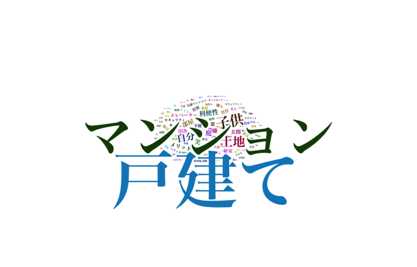
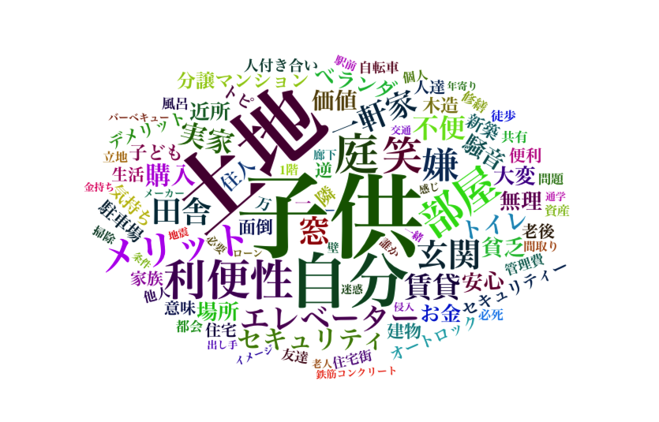
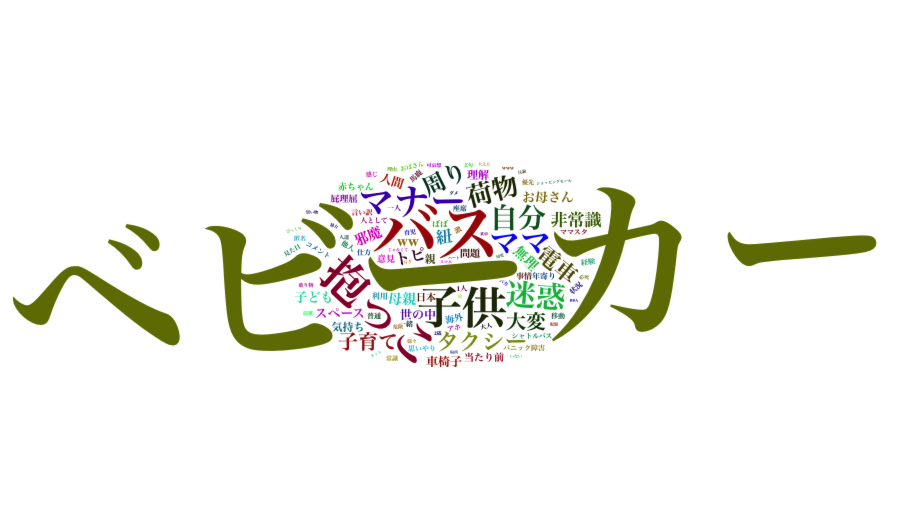
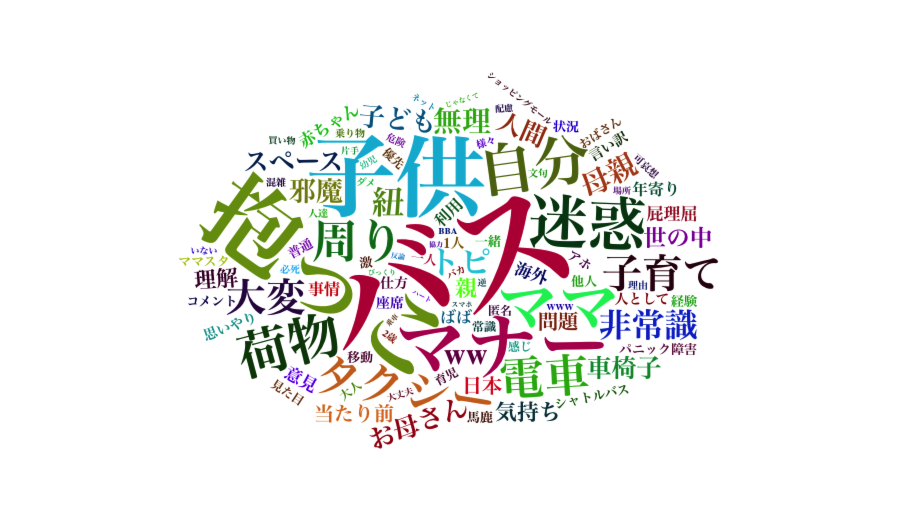

## ママスタBBS運用業務(記事提供)のネタ探し効率化に繋がる分析

データ期間： 2017/9月〜11月

 1. 「なんでも」カテゴリに絞り、3カ月でコメント数上位のトピック
 2. トピックごとの特徴ワードの抽出
 3. トピックごとのワード頻度の分析(ワードクラウド)
 4. 除外ワードの具体的な決め方、ワードクラウド、重要語抽出プロセスで除外ワードを考慮するやり方の模索

## 1. 3カ月間ログでコメント数の上位だったトピックは何か？

### 作業プロセス

プロセス

	

  1.  トピックログの切り出しに「カテゴリ」情報を追加して切りだす(perlスクリプト)
  2.  トピックテーブルとコメントテーブルをマージ、topic_dbにあるカテゴリ[なんでも、など]をtopic_idに結合。(postgreSQL)
  3.  ［なんでも」コメントテーブルを集計してコメント数上位50位までをtsvでエクスポート

###　「なんでも」カテゴリに絞りコメント数上位50位のトピック

	
【要約】

	

	メルカリチャンネルの愚痴、小1の子供の病気に対する対応愚痴、占い、ベビーポケット（養子縁組サイト）、専業主婦、離婚に発展しかねない夫婦トラブル、がコメント数上位に上がってきている

|topic_id|title|message|datetime|cnt|
|:----------|:----------|:----------|:----------|:----------|
|2903588|【メルカリ】メルカリチャンネルの愚痴|メルカリの総合トピでメルカリチャンネルの話が多く、取引についてなどの質問が見ににくなっていますよね。見たくなくてもチャンネルの話が夜になると一気に増えて…見たくない人もいると思いこのトピを立てました。よろしくお願いします。|2017-09-21 16:40:25|3981|
|2915945|集団登校中に体調悪くなった小1の息子がひとり帰された件|集団登校中に体調が悪くなった小1の息子が誰にも付き添われずひとり帰宅させられ納得いきません。集団登校には校外役員さんが付きますが、体調が途中で悪くなったのに誰にも付き添われずにひとり帰宅させられました。まだ入学して数カ月の新入生なのに酷くないですか？役員さんに、体調不良の小1の子をひとり帰すのはひどい！と抗議しましたが、他の子たちの付き添い優先だと言われてお迎えは親の仕事じゃないか？と言われて腹が立ってます。他の子たちは集団でいるし、高学年が複数います。小1の体調不良の息子を優先し、自宅まで送り届けるのが筋ではないですか！？役員さんには、私は仕事もあるからそこまで対応はできない。集団を安全に見守るのが役目で個人個人に対する対応は出来ないから、担任教師と話し合ってと言われてしまいました。第三者的にはどう思いますか？|2017-10-11 16:32:39|1968|
|2926692|2000まで行くぞーー！|前回の1000トピ付き合ってくれた方ありがとう！後アンケートも答えてくれた方もありがとう！今回も暇な人誰でも良いのでもし良かったら順番に数えませんか？目では、私から、1|2017-10-28 18:47:26|1779|
|2890642|直感で答えます！|暇なので あなたの願いが叶うか 直感で答えます！◎←叶う○←８割叶う●←５割叶う  (半々)☆←叶うといいな×←考え直そう注意   直感だから 当たらない|2017-09-01 13:52:06|1762|
|2933049|オバスタ☆”【ババアはここ集合な】|巣|2017-11-08 15:59:56|1690|
|2895641|ベビーポケットについて。|消えたので。プライバシーなさすぎて、こんなトピ作られちゃうんだよ。プライバシー厳守しなよ。養親とか養子待ちだけでやったらいいのに。子供が可哀想。|2017-09-09 00:42:33|1376|
|2898389|質問にハートを押して答えるトピ|聞きたいことを書いてね。|2017-09-13 14:03:46|1371|
|2900183|ババアしか知らない曲のワンフレーズ|2人きりのワンダランド〜|2017-09-16 09:51:06|1212|
|2911247|旦那がいるのに息子を女湯に入れる理由を教えてください|何故？|2017-10-03 22:46:45|1169|
|2904990|ヤッてみたいと思う芸能人にはハート、ムリなら割れハート |お願いします笑|2017-09-23 21:58:33|1166|
|2923237|1000までいくぞーー！|先ずは私から、0|2017-10-22 23:30:01|1006|
|2936529|専業主婦叩きじゃないけど|素朴な疑問。旦那がリストラにあったら、働けなくなったら とか考えないの？特別な職、公務員じゃない限りリストラの危険はあるし、脳梗塞で働けなくなったら？40過ぎるとパート採用率下がるの知らないの？その気になれば働けると思ってるの？だったら楽天家なんだね？貯金なんてなくなるのすぐだよ？リストラ後何年も再就職できない中年男多いよ？再就職できても給料は下がるだろうしね実家が金持とか不労取得があるなら別だけどそんなのないでしょ？|2017-11-14 17:39:49|924|
|2913167|一戸建てのメリットってあるの？|マンションはセキュリティ重視高級感もあるし利便性も高い人付き合いも面倒なことないしね〜マイホーム購入するならマンションむしろ一戸建てって貧乏が買うものじゃない？|2017-10-06 20:55:05|849|
|2898460|隠し子|荒らされてるから、こっちに移します。今、まだ話し合い中だけど、こっちに更新していくからもう向こうは締めまーす。|2017-09-13 16:26:42|750|
|2895583|嫌われるママの特徴|どんな言動？|2017-09-08 22:56:00|744|
|2920852|月五回エッチしにくる|だいたい週イチ、月に4〜5回エッチしにくる既婚男性がいてもう五年くらい続いてます。仕事終わって電車で私の家に来てエッチして1時間近くかけて帰って、わざわざそこまでして五年も続くって彼は私の事をどう思ってるんでしょう？飽きないものなんですかね？少しは好きって気持ちがあるんですかね？|2017-10-19 05:02:42|712|
|2902429|豊田真由子と元秘書、結局、どっちが悪いと思う？|より悪いのは|2017-09-19 22:33:56|684|
|2932481|東尾理子3人目妊娠だって|石田純一すげー|2017-11-07 18:46:57|683|
|2918086|団地に住んでる人は貧乏なんでしょ？|と私の娘がクラスメイトに言われたらしい。「◯◯ちゃんは団地に住んでるから貧乏なんでしょ？ママが団地に住んでる人は貧乏で可哀想って言ってた。」って言われたらしい。ちなみに小学2年生。確かに団地は低所得の人が入るとこだからそう思わせれても仕方ない。ただ子供にそういうこと言います？|2017-10-14 21:06:53|680|
|2904249|みんな夕飯なあに？|作るの面倒くさいよ〜|2017-09-22 17:05:19|677|
|2910887|直感で答えます！《つづきです》|携帯が壊れ 変えたので 改めて作りましたあなたの願いが叶うか 直感で答えます！◎←叶う◯←8割叶う●←5割叶う（半々）☆←叶うといいな×←考え直そう注意  直感だから 当たらない        占いや透視ではありませんので あてにしないで下さいそれでも良ければどうぞ！|2017-10-03 13:19:30|671|
|2924699|一言占い|短く答えます。|2017-10-25 13:05:15|669|
|2933810|女児、大声で叱られＰＴＳＤに　祭り主催の市に賠償命令|なんなんだ。これは。　秋祭りでボランティアスタッフの高齢男性に大声で叱られ、心的外傷後ストレス障害（ＰＴＳＤ）を発症したとして、当時５歳の女児が、主催者の埼玉県深谷市に約１９０万円の損害賠償を求めた訴訟の判決が９日、東京地裁であった。鈴木正紀裁判官は症状との因果関係を認め、約２０万円の支払いを同市に命じた。　判決などによると、女児は両親らと２０１４年１１月に同市内であった秋まつりを訪れた。その際、輪投げ会場で受付の机の上の景品の駄菓子を取ったことを、８０代のボランティア男性に大声で叱られた。女児は駆けつけた父親の前で泣き出し、父親と男性が口論するのを見て、４カ月後にＰＴＳＤと診断された。　裁判で原告側は、叱られた後、女児が両親から離れるのを怖がったり、画用紙を黒く塗りつぶしたりしたと主張。市側は、暴言はなく、症状との因果関係はない、と訴えていた。|2017-11-09 19:33:11|668|
|2922293|デキ婚　ウンコしてからトイレ作る位、計画性無い|デキ婚は、「ウンコしてからトイレを作るくらい計画性が無い」qって。結婚式も好きなドレス着られない新婚旅行も行けない二人の時間も無くて、新婚生活味わえない…息子と娘たちには、デキ婚だけはやめなさい、って話すつもりデキ婚した人、実際どう？言い訳はやめてやー|2017-10-21 12:57:57|655|
|2905452|今日初めて見たわ、激混みのバスでベビーカーのまま乗ってる人|子供は2歳ぐらいかな？ベビーカーで寝てて、ママは座席に座ってた。ベビーカーで寝てて起こしたくない気持ちは分からなくもないけどさ、ふつう人が沢山乗ってきたらベビーカー閉じて抱っこするよね？座席に座れてるんだし！あまりバスに乗らないんだけど、初めてこういう人に遭遇してびっくりした。通路にベビーカー置いてたから皆通りにくそうだったし|2017-09-24 20:24:39|622|
|2910758|子供が周りに嘘をついていた。一軒家は別の場所にあり、ここは仮住まいだよ|子供が友達、何人に話したのかは分かりませんが嘘を言っていた事が分かりました。うちは一軒家ではありません。うちは今はここに住んでるけど一軒家別のところにあって引っ越ししたくないからここにいるだけだよ。休みの日は自分の家に帰っているよって。ママ友から聞かされました。うちは一軒家もないし今後一軒家建てる気もないというか今住んでいるところが団地で相当古い事もあり、後数年したら建て替えるらしく、今引越してしまうと勿体ない感じです。後数年したら新築に移れます。子供に確認はしてみましたがはぐらかされました。えっ！？そんなこと言ったかなぁ〜バァバの家があるって言ったんだよ！勘違いしているんじゃないという風にもうその話はして欲しくない感じで誤魔化しているのが見え見えでした。団地が嫌なのか一軒家に憧れがあるのかだからといって今家を出るのは勿体ないです。団地に住んでる方で娘見たく嘘ついたことある方いますか？|2017-10-03 09:02:24|616|
|2939654|姑の500円貯金を無断で借りててそれがバレて子供が疑われてるんだけど正直に言った方がいいですか？|旦那も子供を疑って正直に言えと怒ってて心が痛いです|2017-11-19 23:30:05|599|
|2923173|透視はできないけど|お悩み答えます！当たるかどうかは責任とれません笑軽い気持ちでどうぞ！|2017-10-22 21:57:58|599|
|2901707|ハッピーセット買ってやらない。子供可哀相かな？|今やってるハッピーセットの玩具。息子が好きなキャラクターなんだけどすぐ飽きるから買ってやらないって可哀相かな？マックが欲しいんじゃなくて、玩具ほしいだけ。どう思う？普段から節約節約だから物をあまり買ってやらないんだけど、可哀相かな？|2017-09-18 21:06:52|596|
|2909981|子どものいない人は税金をたくさん払ったらどうかな。|子どもを育てるのってお金がかかるよね。でも、その子供たちが将来の日本を背負っていくんだよね。子どもがいない人は税金を多く払うようにすればいいと思わない？自分から結婚しない人、選んで子どもを作らない人。結婚したくてもできない人、子どもが欲しいけど何らかの理由があって持てない人。いろいろいるけどさ、実際に子育てにお金がかかることも少子化の原因にもなってるみたいだし、子どものいる人が援助してもらうんじゃなくて、いない人から取るっていう考えはどう思う？|2017-10-01 22:39:17|595|
|2920159|ママ友に仕事を譲ってもらいたい|ママ友が最近仕事を始めました。公民館の事務です。今日、下の子のママ友と一緒に公民館に行った時にばったり会い話を聞くと今は引き継ぎ期間？見習い期間？だそうです。帰りに一緒にいたママ友が私もその仕事がしたい！と言い出して紹介してもらえないか頼んで欲しいと言われました。(そのママ友と下の子のママ友は面識がありません)帰宅後、ママ友に改めて電話してお願いしてみたら採用枠は1人だけでママ友が採用されたので新たに募集はしてないみたいです。下の子のママ友にそれを話したら、なら私にその仕事を譲って貰えるように頼んでくれない？とお願いされました。とても仲がいいママ友なので協力してあげたいですが、そう簡単に譲ってくれるとも思えなくて…どうすれば快く譲って貰えるかアドバイスを下さい。|2017-10-17 23:03:59|588|
|2919462|やっぱり専業主婦って働くママに劣等感ありますよね。|私もそうです。会社に必要とされてて羨ましいと思うことがよくあります。同じ年齢の子がいる同級生はイベント会社でチーフやってて部下もたくさんいるみたいで、いわゆるキャリアウーマンてやつなんですかね。素直に凄いと思うし子供がいながら華やかな世界で部下に頼られバリバリ仕事して、仕事以外の時間は育児も頑張ってる。仕事に子育てに充実してるんだろうなって見てて思います。それに比べて自分は子供を幼稚園に送迎したら一通り家事してあとはテレビ見てボーとしてるだけ。むなしくなることがよくあります。仕事の能力もなく特に会社に必要とされてなかったから妊娠を機に会社辞めた私。社会の何の役にも立ってませんよね。|2017-10-16 22:07:50|571|
|2910181|インスタすごいね|消えたね|2017-10-02 10:21:48|558|
|2911799|配偶者控除廃止 近い将来なるよ。そしたら専業の人|何して働く？|2017-10-04 19:47:27|557|
|2921703|ひとり客でテーブル席に座られたお客さん|ラーメン店のホールでパートしてます。先日、ひとりの女性客がテーブル席に座りました。時間は平日ランチタイム。カウンターは15席のうち半数ほど埋まってました。テーブル席は四人掛けが4席あり、ひと席にふたり客、あとひと席にそのひとりの女性客が座りました。お冷やを持っていったときに、お一人ならテーブル席は。と言ったらお客さんがカウンターいったほうがいいのかしら？と言われたのでいえ、べつにと言いメニューを聞きました。餃子のタレを持っていったときに、もし団体さまが来られたらカウンターに移動してもらうけどいいですか？とお聞きしたらごちゃごちゃ言うならカウンター行くわと怒られたから、いえ、今は空いてるからいいです。と言ったら団体が来たら食べてる最中に移動しろって言うのよね？とさらに怒られたから、もういいですと私は言いひとり客もそのままテーブル席で食べられました。お会計の時に、すごく機嫌悪そうにされていたのですが、わたしの対応は悪かったですか？ランチタイムは、空いていてもひとり客はカウンターだと思うのですが。沢山の方のご意見よろしくお願いします。|2017-10-20 13:11:38|552|
|2896878|三兄弟ＶＳ三姉妹|どっちかなら、どっちがいい？|2017-09-11 10:11:45|516|
|2918533|マンション派の人って戸建ての人に対抗心ありまくりだよね？|あれ、何で？子供がいたら戸建てがいいのは当たり前なのに、高級マンションと普通の戸建て比べてるし、意味わからない。やっぱり戸建て買えないから羨ましいのかな？|2017-10-15 16:49:44|514|
|2927567|介護をしない事で義弟の奥さんと険悪になりました|30代の専業主婦です。夫の実家は車で40分ほど。昨年から義母が寝たきりの状態になりました。義父がメインで介護していましたが、義父も体調を崩すようになり、現在は義弟の奥さんが休職し義実家に泊まり込みで介護をしています。休日は夫や義弟も介護をしますが、私は特に手伝いません。何かあれば家計から援助したいと思っていますが、介護自体は夫が私にさせたくないようなので。義弟の奥さんから私にも介護を手伝ってほしいと言われました。義弟夫婦も夫が私に介護をさせたくないと言っているのは知っていますが、このままでは義弟の奥さんが仕事を辞めなければならなくなるそうです。義弟の奥さんは義母に子育てを手伝ってもらっていたし、介護で恩返ししたら良いのにというのが私の本音です。夫の気持ちもあるので私は介護は手伝いませんが、実の息子である夫や義弟よりも私に主力になってほしいという気持ちがわかりません。|2017-10-30 03:56:04|501|
|2913325|県営団地　子沢山　一家５人死亡　殺された嫁が不倫|殺された嫁が不倫してたんだって|2017-10-07 05:37:41|499|
|2926512|一言占い②|・短く答えられる内容でお願いします。・内容によりお答え出来ない場合があります。|2017-10-28 13:19:26|496|
|2927331|悠仁さまが筑波大学附属中に訪問 特別制度に「不公平」との声も|【ざっくり言うと】・筑波大学附属中に訪問したという悠仁さまについて女性セブンが報じた・同校への受験が噂されており、悠仁さまのために特別な制度が作られたそう・書類審査だけで進学できるため、「不公平」との声も出ているという◇　◇　◇悠仁さま　東大合格者多数輩出難関私立一貫校の文化祭ご訪問※女性セブン2017年11月2日号 　都内の某私立中学校は、高校からの募集を行わない完全中高一貫校。中学受験での偏差値は70近いという最難関校で、毎年30名前後の東大合格者を輩出している名門だ。9月上旬、この中学校で行われた文化祭の来訪者に、生徒や保護者は度肝を抜かれた。「秋篠宮家の悠仁さまがいらっしゃっていたんです。周囲には6人くらい護衛らしき人がいて少し物々しい雰囲気でした。悠仁さまは各教室で行われた展示をご覧になっていました。もしかしてウチを受験されるんでしょうか？」（保護者の1人）　現在、お茶の水女子大学附属小5年生の悠仁さま。お茶の水の高校は女子校なので、悠仁さまをはじめ男子児童がエスカレータ式に内部進学できるのは中学まで。そのため、その前段階の中学進学を機に別の学校を選択する児童も多い。「悠仁さまはお茶の水小に隣接する筑波大学附属中に進学されるのではないかといわれてきました。そのために、“特別な制度”まで作ったんですから…」（お茶の水関係者）　その特別な制度とは、両校の間で行われる「提携校進学」のこと。双方の小学校から若干名を募集し、中学進学のタイミングで“交換”するというものだ。書類審査だけで、いわゆる「学力テスト」は不要だ。「悠仁さまが受験をせずに筑波中に進学できるように作られた制度だともっぱらの噂です。悠仁さまが進学されたら数年のうちに廃止されるとまでいわれています」（筑波関係者）　かねてから、悠仁さまの東大進学が紀子さまの悲願だといわれてきた。偏差値75という超名門の筑波中に進学できれば、良好な学習環境のもとエスカレータで高校までの6年間を過ごし、東大進学も近づくというわけだ。だが、ここにきてその「東大ルート」に暗雲が垂れ込めている。「自由闊達な校風が変化してしまうのでは、と不安を漏らす筑波側の関係者やOBが多くいるんです。これまでに皇族方が入学されたことはありませんし、もし入学されれば、学校全体に活動の制約も多くなるでしょう。また、“充分な警備体制を作ることが難しい“という声もあります」（別の筑波関係者）　加えて、他の受験生との「不公平さ」を訴える声も聞こえてくる。「そもそも、お茶の水幼稚園に入園するときから、悠仁さまには新設された『特別入学制度』が適用されました。ですがその後、その制度は利用すらされていません。“幼稚園から約3km圏内に居住”という入園条件も無視した特別待遇ですからね。同じようなことが、また行われようとしている。私立の学校ならまだしも、国立の学校がこれをやってしまうと、正直、受験勉強を頑張って合格してくる他の子供たちに示しがつきません。筑波側としては、“ご遠慮願いたい”というのが本音のようです」（前出・筑波関係者）　そういった空気を察知した結果が、冒頭の悠仁さまの「文化祭見学」だったのかもしれない。お受験関係者によると、「生徒たちの学校での日常風景を知るには文化祭は絶好の機会」だという。「もしかしたら、悠仁さまの進学先が当初いわれていた筑波中とは別になるかもしれません。ですが、目指すべき東大は変わりません。また、今年7月に紀子さまと悠仁さまがお2人で私的に小笠原諸島を訪問され、戦没者を追悼する碑に献花し黙とうを捧げられたように、紀子さま流の『帝王教育』も同時並行で行われています」（宮内庁関係者）　悠仁さまの目には、自身の進学先はどのように映っているのだろう。http://news.livedoor.com/article/detail/13773081/|2017-10-29 19:32:55|496|
|2924038|風邪引いてる子を連れてくるな！|今日は子供館で絵本の読み聞かせやる日だから行ってきたんだけどそこに明らかに具合悪そうな子が。ずーっと咳してて青い鼻水垂らしてるのにマスクもしてない。ずっとお母さんに抱っこされてる。そのお母さん「そんなに具合悪いなら帰る？◯◯が行きたいって言うから連れてきたのにそんなんでお話聞けるの？」と。勿論その子は帰りたくないの一点張り。絵本の読み聞かせ10分前に着いたんだけどその子の風邪もらいたくないから聞くのやめて帰ってきた。てか「◯◯が行きたいっていうから連れてきた」じゃなくて具合悪いなら行きたいって言っても連れてくるなよ。いますよね。なんも考えず連れてくる人。我が子悪化したらどうしようとか他の子に迷惑かけるとか考えないんだね。とりあえず読み聞かせ聞かずに帰ってきたから移らなきゃいいなぁ。|2017-10-24 12:03:35|493|
|2914190|嫌いなママがメニエールになった。|優しいんだけどどこか抜けていてこっちがキツく話してもニコニコしてるママがいる。この人は私には合わなくて、年下だったしポツンで言い返してこないからキツいこと言ったりしたのは事実。周りがちょっとイライラするような子。最近PTAの係活動休んだらしくて「みんな来たのにどうして休んだの？」って聞いたら、「すみませんでした。メニエールになってしまって辛くて動けなかったんです…」だって。だから「メニエール程度で動けないなんて甘えじゃない？変わってるって言われるでしょ？」と聞いたら相手の目が真っ赤になり「凄くある人の事で悩んでいて、ずっと悩んでいたらある日突然物凄い耳なりと目眩が来てしまったんです。」と言われた。私が悪い訳じゃないよね？メニエール位薬で治るでしょ？メニエールでうごけないのは甘えだよね？|2017-10-08 17:23:30|493|
|2934672|母親でも主婦でもない、ただのOLです|ここでだとバレそうもないので質問させてください。入社５年の25歳です。同期の結婚式で別の同期と喧嘩になりモヤモヤと気になっています、同期は私の生活が【ヤバイ】といってきます。入社して一度も・歓送迎会、新年会忘年会に参加しない・親の送り迎えがあるので終業後に飲みや食事に行かない・母が作った弁当があるので外でランチした事がない。・実家はアパート住まいで自分の部屋がない・父は定年退職して母は専業主婦で今は年金と私の給料で生活している同期との飲み会に参加したのも初めてだったので色々聞かれて答えていましたが、途中から「やばい」「えっ？」「その生活で満足なの？」等言われ、私は「会社にも誰にも迷惑かけてない」と喧嘩になりました。しかし、後から考えたら私は普通ではないのか？ヤバイ分類なのか？とモヤモヤとしています。|2017-11-11 12:53:19|490|
|2925788|よし。オフ会しよっか。|都内で。どう？|2017-10-27 09:31:37|482|
|2923026|正直に。選挙行きましたか？集計|正直に言ってください。|2017-10-22 18:07:52|477|
|2901290|これ知ってたら結構いい歳|キャラクターでもテレビでも音楽でも|2017-09-18 00:57:51|470|
|2893734|山尾志桜里|やしろ優にしか見えない|2017-09-06 08:19:35|469|
|2889641|【身長についてのアンケート】女で身長１７５センチと１４５センチだったらどっちになりたい？|？|2017-08-30 23:01:12|457|
|2919914|療育センターで知り合ったママ友が妬ましい|療育センターに息子が幼稚園時代に通っていた。今は小3になります。その療育センターで知り合ったママ友が妬ましい。子供は軽度で結局は成長が追いつき勉強も対人関係も正常域。学校は普通学級。勉強の遅れもなし。しかも、お金に余裕があり旅行だレジャーだ外食だと楽しそうだし、服もしょっちゅう買っていて妬ましい。療育センターで知り合ったママ友とたまに息抜きランチした時にそのママの悪口言って憂さ晴らし。みんな、ありえない！療育センターも冷やかしだったんだ！と言い合ってる。そうでもしないと、なかなか気持ちの折り合い付かない。|2017-10-17 16:22:40|447|

## 2.トピックごとの特徴ワード抽出

### 2.1.方法

<dl>
<dt>TF-IDF（term frequency-inversed document frequency)</dt>
	<dd>
	 各文書の特徴を抽出する定量的な方法、文書要約に使う技法 
	TF(単語の観測頻度）× IDF(その単語が出現する文書の数で文書の総数を割った値を対数を取ったもの） 
	TF-IDFが大きいほど、その文書に特徴的なワードであると判断する 
 TF-IDFは、当該文書内の単なるTF(単語の観測頻度)ではなく「他の文書には使われていないがこの文書には使われている頻度が高い」ワードを抽出できる。 
 

例）「私」：どの文書でも多いワード。頻度は高いがどの文書でも当たり前に使われるワードなので重要度は低い。 
「保育園」：その文書での出現率が高い。文書全体では出現率は低くても、その文書では高い→文書の特徴を表す重要語と考える。 
</dl>

### 2.2. 作業プロセス

1.  topicごとに1つのファイル、または1つのまとまりにデータをまとめる

  	1.1. コメントテーブルをtopic_id毎にexport(postgresSQL)

  	1.2. topic_id毎にコメントを１つのファイル(topic_id)にエクスポート(perl)

1. topic毎に１つの文書として形態素解析(MeCab)を行い、***ターム・文書行列***を作成。TFIDF計算(RのdocMatrix2関数)
 	
	 - (まずは事例として)名詞だけ抽出
	 - このさいにコメントの順番は考慮していない（コメントをしたユーザーの区別を考えず、コメント時間も考えていない）

1. 除外ワード設定

 	すべてのトピックをまとめて1つの文書と考え、文書内のワード毎の品詞タグづけと頻度をカウント。品詞のうち名詞だけを対象に、品詞詳細分類レベルで、除外すべきグループを判定

 	- 例) 「名詞」のうちの「数詞」「非自立語」「接尾辞」「代名詞」「副詞可能」を除外対象とした

 
1. トピック毎に、***TFIDF***の降順に上位30ワードでトピを要約させる。

 

### 2.3. 除外ワードの精査

1. 名詞のうちの「副詞可能」
	
	- [副詞]：おもに動詞，形容詞，副詞を修飾して，それらの意味に様態や程度などのうえでの制限を加える働きをもつ。
	- 時間を表す名詞などがここに含まれる

	

具体例 

	

	|Term|Freq|
	|:----------|:----------|
	|今|1508|
	|前|795|
	|今日|563|
	|時間|425|
	|絶対|404|
	|最近|286|
	|結局|278|
	|一番|277|
	|昨日|273|
	|場合|252|
	|全部|238|
	|たくさん|235|
	|明日|229|
	|将来|216|
	|毎日|213|
	|朝|199|
	|全て|184|
	|昔|173|
	|今回|166|
	|夜|146|

	

1. 名詞のうちの「非自立」

	- 「非自立」：それだけでは意味をなさない言葉

	

具体例

	|Term|Freq|
	|:----------|:----------|
	|の|8162|
	|ん|7672|
	|こと|3948|
	|事|2009|
	|よう|1853|
	|方|1807|
	|みたい|1537|
	|時|961|
	|もの|639|
	|ところ|486|
	|気|486|
	|以上|429|
	|もん|413|
	|わけ|404|
	|ため|391|
	|うち|384|
	|中|364|
	|様|320|
	|為|309|
	|とき|306|

	

-  名詞のうちの「接尾辞」

	- 「1こ目」「3人」「っぽい」「的だ」
	-  懸念点「歳」や「年」「児」といった子供の年齢を表すワードは削除しないほうがいい。

	

具体例

	|Term|Freq|
	|:----------|:----------|
	|さん|2801|
	|そう|1606|
	|人|796|
	|主|544|
	|さ|490|
	|的|459|
	|目|450|
	|達|423|
	|中|420|
	|者|411|
	|w|334|
	|ちゃん|315|
	|様|305|
	|年|280|
	|児|255|
	|歳|232|
	|ら|229|
	|後|219|
	|方|207|
	|すぎ|198|

	

	

-  名詞のうちの「数詞」
	- 頻度をカウントした時に最も多かった詳細分類のカテゴリ

- 名詞のうちの「代名詞」

### 2.4. TFIDFトピック毎の要約語、重要語の抽出結果

1. 一例 topic_id_2904249の例

	
topic_id_2904249の例

	

	|Term|topic_id_2904249|
	|:----------|:----------|
	|サラダ|526.124943661571|
	|味噌汁|509.987515196709|
	|白菜|191.891110452341|
	|大根|169.315685693242|
	|ほうれん草|166.096404744368|
	|おでん|163.671829503467|
	|煮物|158.296853873089|
	|鍋|148.603398072791|
	|餃子|146.740260934143|
	|スープ|141.6490232935|
	|納豆|129.657842846621|
	|塩焼き|126.23326760572|
	|白米|119.589411415945|
	|豚汁|119.589411415945|
	|鮭|119.589411415945|
	|豆腐|117.707916982554|
	|ご飯|114.495888620756|
	|小松菜|112.94555522617|
	|トマト|107.23326760572|
	|鯖|106.301699036396|

	

	

1. 全てのトピックのTFIDF抽出結果

	

	
結果

	
	|topic_id|1|2|3|4|5|6|7|8|9|10|11|12|13|14|15|16|17|18|19|20|num_comment|
	|:----------|:----------|:----------|:----------|:----------|:----------|:----------|:----------|:----------|:----------|:----------|:----------|:----------|:----------|:----------|:----------|:----------|:----------|:----------|:----------|:----------|:----------|
	|topic_id_2903588|笑笑|配信|slime|信者|チャンネル|メルカリ|プリン|無駄|出品|通報|商品|お菓子|購入|配信中|ライト|コメント|店長|笑|停止|レビュー|3981|
	|topic_id_2903588|69232.5655| 4947.5980| 1421.7852| 1225.7859| 1173.6633| 1154.7869| 1074.2204| 1059.4167|  919.9486|  536.3654|  529.4372|  514.5495|  477.1874|  445.1384|  419.8882|  419.2863|  414.9051|  406.5128|  383.7822|  318.9051|3981|
	|topic_id_2915945|役員|登校|学校|班|息子|集団|子供|親|付き添い|自分|下校|仕事|文句|体調不良|連絡|責任|体調|抗議|親子|躾|1968|
	|topic_id_2915945|1193.8357| 974.4713| 743.0230| 544.5629| 421.5443| 406.6691| 316.9768| 313.2970| 288.3569| 255.9778| 233.3841| 213.1964| 209.0111| 208.9826| 194.5638| 194.0000| 190.8265| 185.8429| 183.2300| 179.5484|1968|
	|topic_id_2926692|１|2000|６|７|０|２|９|８|8249|8250|３|8226|４|５|2017|1999|865|トピ|811|前回|1779|
	|topic_id_2926692|143.31537|129.65784|103.89328| 76.33059| 68.77687| 57.22680| 54.73931| 40.73079| 39.86314| 39.86314| 32.15760| 30.35336| 28.77689| 28.72422| 28.21928| 26.57542| 25.50699| 22.23677| 21.86314| 20.84359|1779|
	|topic_id_2890642|直感|○|お願い|よろしくお願いします|旦那|幸せ|仕事|再婚|占い|連絡|大丈夫|離婚|供養|職場|浮気|結婚|お子様|元旦那|進展|出会い|1762|
	|topic_id_2890642|851.41983|525.43005|170.65565|167.61738|135.02440|107.39114|103.04494|102.25573| 92.07603| 88.78153| 81.72530| 78.96955| 73.08242| 69.64913| 66.79614| 66.32690| 66.00469| 66.00469| 64.82892| 64.23677|1762|
	|topic_id_2933049|BBA|オバスタ|笑|ネズミ|生理|obaba|仕事|ー|弁当|風邪|咳|お早う|白髪|土鍋|体操|雪国|更年期|4時間|ババァ|痰|1690|
	|topic_id_2933049|342.18222|245.82268|226.41220|132.87712|122.91134|121.41345|116.07361|103.48040|102.02797| 99.27754| 97.41345| 94.18933| 92.87712| 86.37013| 84.65784| 79.72627| 79.53124| 75.88341| 73.89807| 73.08242|1690|
	|topic_id_2895641|養親|マザー|養子|該当|ダウン症|実親|養子縁組|ベビー|ポケット|幹部|団体|blog|代表|HP|待機|退会|障害|特別養子縁組|子供|ダウン|1376|
	|topic_id_2895641|2484.8022|1156.0310|1123.7013| 998.4291| 667.7740| 655.8941| 515.4680| 490.7127| 414.8293| 391.9875| 385.5949| 382.6441| 364.3856| 352.1244| 328.4665| 320.4261| 316.0000| 298.9735| 296.2807| 293.4158|1376|
	|topic_id_2898389|ハート|ひと|好きな人|旦那|子供|異人|自分|ハ|ト|ママスタ|洗濯|風呂|中の人|予定|エッチ|結婚|ー|不倫|中国|朝ごはん|1371|
	|topic_id_2898389|527.66737|178.79432|130.37606|112.52033| 76.24871| 60.69934| 53.37410| 51.08242| 48.70672| 48.56141| 41.39752| 39.58290| 39.50699| 38.21324| 34.57542| 33.90042| 32.67802| 32.16111| 30.35336| 30.35336|1371|
	|topic_id_2900183|ー|恋|I|夏|胸|夢|涙。|花|歌|Me|そばにいて|ザ|バン|泣かないで|薔薇|らん|春|キス|空|罠|1212|
	|topic_id_2900183|238.54955|151.26748| 70.82451| 66.79614| 63.90983| 54.42649| 52.98150| 47.37013| 42.20151| 39.86314| 39.86314| 39.50699| 39.50699| 39.50699| 39.50699| 36.53004| 36.53004| 36.43856| 35.41226| 35.41226|1212|
	|topic_id_2911247|湯|男湯|男の子|風呂|男児|銭湯|女の子|家族風呂|湯煮|条例|温泉|旦那|ママ|息子|女児|子供|訓練|嫌|異性|小学生|1169|
	|topic_id_2911247|750.6329|671.0295|564.1369|539.3170|381.5360|372.0559|328.4374|325.5490|248.3297|245.8227|240.4945|238.0693|175.8164|156.2367|153.4601|116.5516|116.3546|114.3731|107.4220|106.4486|1169|
	|topic_id_2904990|杉浦太陽|竹野内豊|えなりかずき|藤木直人|西島秀俊|ハート|斎藤工|AAA|ジョニー・デップ|加藤鷹|大沢たかお|岩田剛典|平井堅|松坂桃李|田中|藤ヶ谷太輔|藤原竜也|小栗旬|成宮寛貴|今市隆二|1166|
	|topic_id_2904990|53.15085|53.15085|39.86314|39.86314|39.86314|33.90042|33.86314|33.21928|33.21928|33.21928|33.21928|33.21928|33.21928|33.21928|33.21928|33.21928|33.21928|28.21928|28.21928|26.57542|1166|
	|topic_id_2923237|８|９|7|1000|０|７|１|３|131|101|136|５|２|113|137|123|150|４|お早う|６|1006|
	|topic_id_2923237|74.27379|60.21324|53.84593|38.31752|35.18817|21.20294|20.13522|19.29456|18.57542|16.93157|13.93157|13.51728|13.39351|13.28771|12.96578|12.17668|12.17668|12.11659|11.77367|11.33381|1006|
	|topic_id_2936529|パート|リストラ|社員|専業主婦|正社員|専業|旦那|笑|貯金|リスク|会社|無職|無能|学歴|能力|オッサン|社会貢献|自分|保険|採用|924|
	|topic_id_2936529|430.39592|273.18026|247.59252|243.58994|232.53497|211.29546|175.29484| 93.65232| 90.55520| 88.70792| 83.93613| 82.59013| 80.16484| 76.42619| 74.21794| 72.89352| 70.82451| 66.44531| 66.09640| 65.22052|924|
	|topic_id_2913167|マンション|戸建て|一戸建て|利便性|土地|庭|窓|一軒家|エレベーター|セキュリティ|騒音|メリット|子供|玄関|ベランダ|不便|セキュリティー|住宅街|木造|部屋|849|
	|topic_id_2913167|1631.2593|1055.0378| 801.6484| 282.1928| 268.2226| 195.6616| 171.8227| 151.2675| 142.0613| 134.6718| 120.7403| 120.4265| 118.7301| 111.8498| 108.0482| 107.6919| 107.2333| 106.3017| 106.2368| 103.8944|849|
	|topic_id_2898460|義姉|義兄|愛人|義父|不倫|隠し子|子供|義母|ガン|母|離婚|旦那|闘病|癌|嫁|両親|スレ|200万|子供達|相手|750|
	|topic_id_2898460|1712.8531|1650.9765|1542.9626| 411.9191| 321.6111| 220.1104| 197.1574| 195.6454| 161.1331| 157.1570| 154.2661| 152.7908| 146.1648| 138.1140| 136.0000| 134.0957| 127.2177| 120.7403| 118.2859| 118.1064|750|
	|topic_id_2895583|ママ|自分|悪口|自慢|スピーカー|子供|噂|パパ|笑|他人|キーパー|ママ友|早口|親|挨拶|天然|アピール|意地悪|相手|506|744|
	|topic_id_2895583|142.76823|125.26574| 76.55232| 72.08601| 70.82451| 70.80238| 50.23327| 49.26538| 47.34073| 43.73434| 39.86314| 38.86833| 37.15085| 35.69206| 35.32100| 32.47115| 30.67672| 27.86314| 26.78701| 26.43856|744|
	|topic_id_2920852|不倫|ww|風俗|おっさん|エッチ|タダ|5年|奥さん|結婚|相手|Д|５|性欲|35歳|セックス|彼氏|普通|無料|関係|五|712|
	|topic_id_2920852|91.53545|91.07963|90.76804|87.93154|86.43856|79.90042|69.02262|68.00000|66.32690|65.74994|61.94556|59.13810|57.54752|56.18507|54.13522|53.53124|51.13884|51.12787|49.74583|49.47862|712|
	|topic_id_2902429|秘書|豊田|議員|暴言|真由子|録音|会見|ミス|暴力|政治家|ハゲ|豊田真由子|仕事|無能|謝罪会見|ヤフコメ|自分|被害者|パワハラ|どっちもどっち|684|
	|topic_id_2902429|1295.63588| 664.07144| 282.36389| 198.86208| 186.24725| 172.00239| 146.70792| 128.47353|  94.82570|  93.79614|  92.07603|  92.07603|  91.20069|  80.16484|  79.72627|  70.82451|  59.90970|  58.86833|  56.82451|  52.10897|684|
	|topic_id_2932481|理子|不妊|治療|妊娠|凍結|石田純一|東尾理子|お金|体外|自然|子供|石田|純一|3人|体外受精|保存|胚|すみれ|ビンボ|受精卵|683|
	|topic_id_2932481|352.12438|291.39823|185.54484|150.29924|146.16484|135.45255|126.23327|108.39810| 99.65784| 97.14295| 96.94479| 90.30170| 86.37013| 72.09000| 70.82451| 66.43856| 66.43856| 65.76562| 53.15085| 53.15085|683|
	|topic_id_2918086|団地|家賃|貧乏|一軒家|団地の|子供|UR|モンブラン|親|低所得|戸建て|差別主義|収入|ローン|貯金|賃貸|転勤|所得|お金|マンション|680|
	|topic_id_2918086|1144.17084| 177.17049| 125.06152| 116.69206| 116.35455| 107.83747| 106.23677|  84.40303|  77.99376|  65.58941|  65.22052|  59.79471|  57.24794|  55.92491|  48.76049|  47.09466|  44.58194|  43.72627|  42.30170|  42.30170|680|
	|topic_id_2904249|サラダ|味噌汁|白菜|大根|ほうれん草|おでん|煮物|鍋|餃子|スープ|納豆|塩焼き|白米|豚汁|鮭|豆腐|ご飯|小松菜|トマト|鯖|677|
	|topic_id_2904249|526.1249|509.9875|191.8911|169.3157|166.0964|163.6718|158.2969|148.6034|146.7403|141.6490|129.6578|126.2333|119.5894|119.5894|119.5894|117.7079|114.4959|112.9456|107.2333|106.3017|677|
	|topic_id_2910887|直感|お願い|旦那|よろしくお願いします|仕事|離婚|お子様|背|希望|連絡|金銭|縁|言い様|2年後|浮気|体調|良好|気持ち|マイホーム|再婚|671|
	|topic_id_2910887|484.05595| 54.06912| 41.45486| 40.08242| 34.34831| 33.05702| 31.26538| 30.69201| 30.00000| 28.33453| 27.36966| 24.73931| 23.01901| 20.23557| 19.79145| 19.08265| 18.57542| 18.51754| 18.50699| 17.89475|671|
	|topic_id_2924699|お願い|旦那|離婚|仕事|再婚|結婚|主人|ミニメ|性別|運気|浮気|職場|引っ越せますか|子供|無事|好きな人|712|お答え|御返事|元気|669|
	|topic_id_2924699|54.06912|43.82371|34.89352|31.97946|30.67672|26.53076|26.00000|22.57542|21.89572|20.23557|19.79145|19.64463|18.57542|18.51754|18.35336|17.89475|17.28771|16.23557|16.23557|16.00000|669|
	|topic_id_2933810|親|口論|PTSD|5歳|判決|大声|裁判|父親|景品|ＰＴＳＤ|子供|深谷市|裁判官|注意|祭り|爺さん|女児|お菓子|お爺さん|じいさん|668|
	|topic_id_2933810|329.16010|303.53362|299.12438|237.86308|237.04196|186.70911|182.19281|180.22501|159.91134|152.80869|141.60475|132.87712|131.53124|110.19008|104.21794|103.72627|103.58553| 93.05683| 93.01399| 93.01399|668|
	|topic_id_2922293|デキ婚|婚|結婚|でき婚|出来|避妊|プロポーズ|幸せ|子供|うんこ|不妊|妊娠|ドレス|新婚旅行|ハッピー|ダブル|計画|結婚式|トイレ|笑|655|
	|topic_id_2922293|950.82418|744.11189|235.82899|232.53497|182.19281|155.58941|152.80869|150.97015|131.80135|126.23327|117.73666|107.06247| 96.11898| 95.94556| 95.08242| 85.23677| 82.59013| 73.08242| 71.87786| 63.80707|655|
	|topic_id_2905452|ベビーカー|バス|抱っこ|タクシー|マナー|荷物|紐|車椅子|電車|スペース|子供|迷惑|非常識|ママ|シャトルバス|座席|子育て|笑|パニック障害|邪魔|622|
	|topic_id_2905452|1010.66453| 254.53780| 195.76920| 148.60340| 147.17082| 102.11405|  89.29566|  78.94556|  76.69187|  73.06009|  67.53457|  57.23308|  56.90042|  56.84291|  50.79471|  50.58894|  47.31048|  46.31159|  45.53004|  45.52264|622|
	|topic_id_2910758|団地|家賃|一軒家|新築|娘。|嘘|子供|貧乏|アパート|友達|お金|ディズニー|自分|建て替え|旅行|親|USJ|ユニバーサルスタジオジャパン|万|マンション|616|
	|topic_id_2910758|706.90810|291.81022|246.34990|244.13836|196.89451|163.42130|148.14036|123.32456|119.58941| 99.14461| 96.50075| 95.91253| 71.89164| 70.82451| 69.90159| 68.74026| 66.43856| 66.43856| 56.93154| 52.87712|616|
	|topic_id_2923173|お願い|旦那|子供|再婚|仕事|よろしくお願いします|透視|妊娠|職場|二子|連絡|前妻|幸せ|好きな人|浮気|気持ち|直感|占い|性別|夫|599|
	|topic_id_2923173|55.75878|46.19256|33.76729|33.23311|33.16389|32.79471|32.47115|28.82451|28.57400|27.86314|26.44556|25.29447|24.90229|23.00754|22.26538|21.78535|21.60964|19.18251|19.15876|18.88969|599|
	|topic_id_2939654|子供|泥棒|窃盗|母親|離婚|姑|自分|正座|お金|課金|旦那|自白|子ども|無断|親|手癖|保身|正直|義母|白状|599|
	|topic_id_2939654|338.76214|244.30357|174.95954|169.63220|168.95812|147.49807|126.35501|119.58941| 95.17882| 91.06009| 90.01627| 84.65784| 83.85310| 83.58941| 79.31569| 73.37013| 70.82451| 69.27477| 63.45255| 60.37013|599|
	|topic_id_2901707|HAPPY SET|節約|酒代|マック|子供|おもちゃ|blog|我慢|390円|オモチャ|可哀想|ポテト|旦那|息子|外食|ww|クリスマス|貯金|キュウレンジャー|食費|596|
	|topic_id_2901707|757.39961|203.80317|186.02797|176.47906|168.83644|161.13305|120.68008|117.86776|107.23327| 96.11898| 79.56793| 79.01399| 78.17202| 73.69656| 73.24177| 73.22088| 72.95255| 71.97977| 66.43856| 65.22052|596|
	|topic_id_2909981|税金|子供|小梨|世帯|不妊|専業主婦|自分|独身税|子育て|独身者|いない|独身|免除|お金|貢献|年金|日本|税|子持ち|生活保護|595|
	|topic_id_2909981|358.72002|294.10218|156.00358|114.79324| 97.13274| 93.05683| 92.58772| 79.72627| 79.41401| 79.01399| 78.79033| 76.00000| 74.30170| 74.02797| 72.95255| 72.87712| 71.78081| 70.82451| 68.07603| 67.29566|595|
	|topic_id_2920159|公民館|ママ友|採用|仕事|紹介|シンママ|朝井|ママ|浅井|自分|前任|友|非常識|シングル|見習い|499|職場|選り好み|事務|あほ|588|
	|topic_id_2920159|597.94706|324.55055|176.47906|168.18829|159.06247|125.41464| 79.01399| 68.74026| 66.43856| 62.08824| 59.79471| 59.79471| 59.37435| 53.40435| 53.15085| 46.01508| 42.86100| 39.86314| 38.89735| 38.21324|588|
	|topic_id_2919462|兼業|専業|社会貢献|専業主婦|大手|社会|劣等感|仕事|笑|旦那|パート|子供|自分|余裕|大手企業|家事|正社員|奥様|お金|何役|571|
	|topic_id_2919462|408.11189|345.96729|131.53124|125.90042|111.45255|104.48676|103.72627| 90.01627| 82.33171| 73.43432| 57.14801| 55.55263| 51.19556| 49.80459| 46.50699| 44.53076| 43.18507| 39.76562| 39.65784| 38.89735|571|
	|topic_id_2910181|Instagram|アカウント|写真|フォロワー|子供|投稿|ちえ|笑|ハゲ|自分|女装|開示|チエ|ブス|女の子|モデル|特定|みっき~|コーデ|赤ちゃん|558|
	|topic_id_2910181|163.97353| 79.01399| 67.33591| 60.37013| 57.73117| 57.31964| 53.15085| 49.39902| 46.03802| 41.39216| 39.86314| 39.86314| 39.50699| 38.33486| 36.92491| 36.53004| 34.63504| 33.21928| 33.21928| 33.05702|558|
	|topic_id_2911799|配偶者控除|専業|税金|専業主婦|廃止|控除|扶養|万|国保|子供|就労|兼業|保育園|旦那|納税|パート|社会保険|所得税|世帯|増税|557|
	|topic_id_2911799|310.41209|276.30944|235.02346|213.48332|198.88579|197.29685|142.43118|117.53608|106.30170|102.39113| 95.94556| 94.74026| 82.69148| 79.35645| 72.89352| 67.86326| 65.76562| 60.37013| 58.86833| 56.43856|557|
	|topic_id_2921703|カウンター|テーブル席|お客様|接客|店員|移動|案内|テーブル|団体|ランチタイム|ひとり|接客業|ラーメン屋|ラーメン店|相席|対応|最初|餃子|店長|飲食店|552|
	|topic_id_2921703|812.67483|504.93307|255.71030|235.41583|219.18026|208.00939|178.59132|155.58941|129.88460|106.23677|104.81213|101.17787| 90.30170| 86.37013| 86.37013| 81.05540| 75.09233| 67.72627| 60.50699| 60.50699|552|
	|topic_id_2896878|三姉妹|男の子|女の子|三兄弟|姉妹|ママ|娘。|3人|投票|連投|息子|三|孫|自分|笑|性別|兄弟|不細工|嫌|上げ|516|
	|topic_id_2896878|349.06366|265.59729|217.66264|203.17882|123.62349| 91.21304| 75.72866| 72.09000| 69.23327| 65.23953| 64.85297| 59.13810| 55.72627| 45.74923| 43.22415| 41.05448| 39.11898| 38.21309| 37.03509| 35.41226|516|
	|topic_id_2918533|マンション|戸建て|対抗|管理費|高級|一戸建て|キッズルーム|1500|託児所|土地|都心|万|6500|都内|1%|タワマン|新築|メリット|トピ|夜景|514|
	|topic_id_2918533|809.01999|740.44474|146.16484|131.53124| 95.91253| 94.74026| 90.30170| 86.43856| 79.01399| 73.89807| 73.47278| 73.46005| 73.08242| 67.29566| 66.43856| 64.82892| 61.94556| 60.21324| 58.23915| 56.43856|514|
	|topic_id_2927567|義弟|介護|施設|義妹|義父|嫁|義母|奥さん|援助|夫|寝たきり|旦那|お金|義親|介護認定|ヘルパー|恩返し|硬膜下血腫|義実家|長男|501|
	|topic_id_2927567|885.30640|883.04797|402.78318|260.88209|182.70605|182.00000|132.19281|126.00000|105.08601|102.00431|101.47234| 98.30724| 89.89111| 88.23953| 86.37013| 86.00119| 84.65784| 79.72627| 77.11898| 76.47234|501|
	|topic_id_2913325|不倫|嫁|薬剤師|子供|旦那|離婚|サレ|浮気|殺人|死刑|子供達|子沢山|奥さん|連れ子|DV|殺害|クズ|豚|妻|報道|499|
	|topic_id_2913325|435.41189|122.00000|111.29566|105.65893| 81.72530| 71.62355| 66.43856| 59.37435| 58.30170| 56.43856| 54.47377| 52.10897| 48.00000| 47.54121| 47.37013| 45.15085| 43.45869| 43.21928| 40.73079| 40.58894|499|
	|topic_id_2926512|明|占い|笑|ミニメ|トピ|企業秘密|○|運気|62歳|西日本|半値|関西|バカ|同一|お願い|大阪|透視|本物|オフ会|月見|496|
	|topic_id_2926512|169.31569| 65.22052| 50.42817| 39.50699| 30.70792| 28.21928| 25.47540| 25.29447| 19.93157| 19.93157| 19.15876| 19.10655| 17.65990| 17.36966| 16.89660| 16.23557| 16.23557| 15.34601| 15.17668| 15.17668|496|
	|topic_id_2927331|悠仁|学習院|東大|皇族|紀子様|天皇|お茶の水|皇室|筑波|学力|女性週刊誌|入学|愛子様|附属|進学|受験|筑波大|制度|秋篠宮様|紀子さま|496|
	|topic_id_2927331|883.63287|538.15235|485.37163|385.34366|279.04196|259.11039|232.53497|172.74026|172.74026|172.00239|163.67183|160.32967|152.80869|135.45255|116.26748|111.84983|106.30170| 96.33591| 93.01399| 93.01399|496|
	|topic_id_2914190|メニエール|目眩|メニエール病|ママ|甘え|委員長|同調|役員|辛さ|自分|45歳|発作|病気|発症|ストレス|スクショ|いじめ|メニエールママ|PTA|周り|493|
	|topic_id_2914190|602.00835|131.53124| 93.01399| 77.99376| 77.11898| 69.65784| 69.15085| 66.46623| 62.08242| 57.73117| 57.54752| 56.43856| 49.80459| 46.03802| 42.74026| 42.20151| 40.28559| 39.86314| 38.36501| 37.30282|493|
	|topic_id_2924038|お萩|風邪|鼻水|咳|笑|マスク|児童館|子供|キーワード|ママ友|具合|トピ|神経質|名前|栗ご飯|自演|感染|読み聞かせ|あおっぱな|プライベートブラウザ|493|
	|topic_id_2924038|276.22809|127.64256|101.47234| 97.41345| 79.24427| 78.94556| 67.72627| 64.26677| 61.81175| 46.64200| 45.38402| 37.06128| 36.53004| 36.29415| 35.41226| 34.82892| 33.86314| 33.86314| 33.21928| 33.21928|493|
	|topic_id_2934672|両親|免許|口座|自分|親|母|25歳|お金|お母さん|父|通帳|お父さん|自立|毒親|給料|相談|生活|管理|OL|お母様|490|
	|topic_id_2934672|163.24698|153.46005|148.60340|143.78329|134.83667|132.15476|126.23327|111.04196|107.59698|107.36852|103.72627|103.02493|102.25573| 87.45255| 86.89256| 79.90042| 75.34990| 74.21794| 73.37013| 73.37013|490|
	|topic_id_2925788|ピエロ|オフ会|笑|村本|コテ|うんこ|渋谷|タワレコ|デネブ|プラネタリウム|咲ちゃん|miffy|大ちゃん|U2|トピ|す|モンチッチ|宝塚|藁|ステ|482|
	|topic_id_2925788|132.87712|121.41345|119.38098|106.30170| 92.87712| 83.04820| 78.94556| 59.79471| 59.79471| 53.15085| 46.50699| 39.86314| 39.86314| 33.21928| 31.76681| 28.41226| 28.21928| 28.21928| 28.21928| 26.57542|482|
	|topic_id_2923026|期日前投票|期日|投票|選挙|大雨|選挙権|投票所|台風|自民党|政治|旦那|公明党|列|田舎|政治家|午前中|高熱|当たり前|文句|党|477|
	|topic_id_2923026|345.48052|119.58941|109.31569| 97.41345| 95.94556| 66.43856| 59.79471| 54.65784| 38.89735| 30.69201| 29.61061| 28.21928| 26.57542| 24.73931| 24.31752| 23.01901| 22.57542| 22.10897| 21.20402| 20.23557|477|
	|topic_id_2901290|12316|あばれはっちゃく|クイズ|アイス|2&|あなたの知らない世界|はらたいら|トミコ|プロポーズ大作戦|ルックルックこんにちは|ロビンちゃん|ロンパールーム|女の60分|CM|魔法|コメットさん|サンリオ|ヤヌスの鏡|司会|歌|470|
	|topic_id_2901290|61.38402|53.15085|33.21928|21.60964|19.93157|19.93157|19.93157|19.93157|19.93157|19.93157|19.93157|19.93157|19.93157|17.36966|17.28771|16.93157|16.93157|16.93157|16.93157|15.34601|470|
	|topic_id_2893734|山尾|不倫|山尾志桜里|当選|落選|愛知|支援者|弁護士|愛知7区|有権者|志緒理|文春|投票|安藤優子|トヨタ|選挙|辞職|選挙区|議員|国民|469|
	|topic_id_2893734|327.34366|205.33629|197.53497|178.59132|116.09640|102.16484| 90.30170| 89.16389| 79.72627| 75.88341| 73.08242| 66.43856| 61.94556| 59.79471| 56.43856| 52.76562| 50.79471| 50.79471| 49.82892| 46.50699|469|
	|topic_id_2889641|145|175|ちび|ヒール|奇形|165|身長|chibi|145cm|デカ|背|160|150|嫌|170|175cm|竹馬|155|ちんちくりん|択|457|
	|topic_id_2889641|259.31569|203.13062|142.62363|106.80869| 95.94556| 81.17787| 72.95255| 59.79471| 46.50699| 39.86314| 38.36501| 32.50699| 32.47115| 30.49949| 30.25350| 26.57542| 26.57542| 25.29447| 22.57542| 20.29447|457|
	|topic_id_2919914|ランチ|療育|ママ友|健常|悪口|貧乏|障害|子供|軽度|センター|旅行|自分|ママ|性格|低所得|お金|TIME LINE|発達障害|フードコート|哀れ|447|
	|topic_id_2919914|175.86308|146.94556|130.20890|125.33591|117.08002|107.69187| 86.00000| 81.69505| 78.94556| 77.11898| 74.27044| 71.89164| 70.06219| 69.27477| 65.58941| 59.48676| 55.64783| 55.10636| 50.79471| 49.53385|447|

		
	

	

## 3.トピックごとのワードクラウド表現

1.  全てのトピックでのワードの頻度分析(名詞だけ、除外考慮)

	- 最も頻度が高かった記号的な文字「笑笑」「笑」と「>>1」のような引用符付のワードが極めて頻度が高かったため、これを除外している。
	- ワードクラウドを作ってみてあまりにも頻度に差があるワードが存在すると、図が1つの単語以外はほとんどフォントが小さくて不明ということがあり得るため、手動での除外ワード設定、除外作業はどうしても発生している

	

1. 任意のトピックを選んで、ワードクラウドで表現（ただし、品詞を名詞、動詞、形容詞に限定）

	- topic_id_2904249の例
		- 名詞については除外詳細品詞分類ワードを考慮
	
	
	- ***このワードクラウドを任意のトピックを選んですぐに表示できるようにシステム化***
	
	- <a href="http://mamastar.jp/bbs/comment.do?topicId=2904249" target="_blank">[みんな夕飯なあに？] </a>

	- topic_id_2913167の例
		- 名詞のみ抽出
		- 除外詳細品詞分類ワードを考慮
		- ワード毎の頻度集計にて、「一戸建て」「戸建て」という同義語が2つに分かれてしまった。手動で「戸建て」に合わせて集計しなおしている。
		
	
	
	- [一戸建てのメリットってあるの？](http://mamastar.jp/bbs/comment.do?topicId=2913167)
	
	このアウトプットでは、圧倒的に頻度の高い2語「マンション」「一戸建て」以外はほとんど何が語られているか把握できない。そこを改善した例が以下。
	
	

	- topic_id_2905452の例
		- 名詞のみ抽出
		- 除外詳細品詞分類ワードを考慮

	- <a href= "http://mamastar.jp/bbs/comment.do?topicId=2905452" target="_blank">[今日初めて見たわ、激混みのバスでベビーカーのまま乗ってる人]</a>

	-

	このアウトプットでは、圧倒的に頻度の高い語「ベビーカー」だけが強調されてしまう。そこを改善した例が以下。こちらには「ベビーカー」はない

	-

	

ワード毎の頻度分布

		

	|term|Freq|
	|:----------|:----------|
	|ベビーカー|249|
	|人間|17|
	|車椅子|17|
	|世の中|16|
	|気持ち|15|
	|理解|15|
	|親|15|
	|問題|14|
	|当たり前|14|
	|日本|14|
	|屁理屈|12|
	|意見|12|
	|海外|12|
	|赤ちゃん|12|
	|ばば|11|
	|事情|11|
	|利用|11|
	|年寄り|11|
	|1人|10|
	|人として|10|
	|仕方|10|
	|座席|10|
	|思いやり|10|
	|言い訳|10|
	|アホ|9|
	|コメント|9|
	|シャトルバス|9|
	|パニック障害|9|
	|ママスタ|9|
	|一人|9|
	|一緒|9|
	|他人|9|
	|普通|9|
	|激|9|
	|状況|9|
	|移動|9|
	|経験|9|
	|馬鹿|9|
	|おばさん|8|
	|優先|8|
	|匿名|8|
	|大人|8|
	|常識|8|
	|感じ|8|
	|育児|8|
	|見た目|8|
	|2歳|7|
	|ダメ|7|
	|バカ|7|
	|乗り物|7|
	|人達|7|
	|危険|7|
	|可哀想|7|
	|必死|7|
	|文句|7|
	|様々|7|
	|混雑|7|
	|理由|7|
	|BBA|6|
	|WWW|6|
	|いない|6|
	|ショッピングモール|6|
	|ネット|6|
	|場所|6|
	|大丈夫|6|
	|幼児|6|
	|片手|6|
	|買い物|6|
	|逆|6|
	|配慮|6|
	|じゃなくて|5|
	|びっくり|5|
	|スマホ|5|
	|ハート|5|
	|乗車|5|
	|協力|5|
	|反論|5|

	

	

	
	#### 【Shiny化する際の課題】
	- wordcloudライブラリでは、最低頻度、最高頻度を指定してユーザーがインタラクティブに結果を探索、再描画できるが、より審美的なアウトプットのwordclud2ライブラリでは、~~頻度の低いワードのフォントサイズを変更するパラメータしかない。~~ SizeとminSizeのパラメータで描画する範囲を決定。minSize=10だと頻度が10以下を書かせない、という意味か？確認。対応できるか検討必要。

	#### 【運用を考えた課題】
	- 除外ワードを自分で登録できるようなシステムだと使いやすいのではないか？
	

## 4. N-gram
<dl>
	<dt>N-gramとは</dt>
	<dd>文章におけるNこの要素の連鎖 
	隣接する要素の機械的な抽出方法</dd>
</dl>

### 4.1. 全てのトピックをまとめてのNグラム例

 1. 「子供」

	

「子供」

		

	|Ngram|Freq|
	|:----------|:----------|
	|[子供-いる]|161|
	|[する-子供]|145|
	|[てる-子供]|113|
	|[自分-子供]|108|
	|[ん-子供]|84|
	|[人-子供]|84|
	|[子供-産む]|84|
	|[子供-いない]|66|
	|[の-子供]|59|
	|[子供-可哀想]|56|
	|[主-子供]|55|
	|[いる-子供]|54|
	|[私-子供]|54|
	|[思う-子供]|53|
	|[子供-作る]|51|
	|[子供-ため]|50|
	|[親-子供]|45|
	|[ない-子供]|44|
	|[なる-子供]|42|
	|[いい-子供]|39|
	|[子供-為]|39|
	|[ある-子供]|38|
	|[子供-育てる]|36|
	|[子供-出来る]|34|
	|[子供-将来]|31|
	|[子供-居る]|30|
	|[子供-頃]|30|
	|[子供-3人]|29|
	|[子供-事]|29|
	|[言う-子供]|28|
		

	

1. 「マンション」

	- 単語のNグラム(品詞を、名詞、形容詞、動詞、副詞に限定、ストップワードを除いていない)

	

「マンション」のNグラム

		

	|Ngram|Freq|
	|:----------|:----------|
	|[マンション-住む]|72|
	|[マンション-戸建て]|41|
	|[マンション-方]|34|
	|[戸建て-マンション]|34|
	|[高級-マンション]|34|
	|[マンション-派]|27|
	|[マンション-買う]|26|
	|[うち-マンション]|25|
	|[する-マンション]|22|
	|[てる-マンション]|21|
	|[ある-マンション]|17|
	|[私-マンション]|17|
	|[いる-マンション]|15|
	|[今-マンション]|15|
	|[いい-マンション]|14|
	|[なる-マンション]|14|
	|[の-マンション]|14|
	|[ん-マンション]|14|
	|[人-マンション]|14|
	|[マンション-いい]|13|
	|[マンション-住まい]|13|
	|[普通-マンション]|13|
	|[良い-マンション]|13|
	|[マンション-子供]|12|
	|[一戸建て-マンション]|12|
	|[マンション-ある]|11|
	|[マンション-人]|11|
	|[マンション-購入]|11|
	|[マンション-選ぶ]|11|
	|[でる-マンション]|10|

	

	

1. 「旦那」

	

		
「旦那」

		

	|Ngram|Freq|
	|:----------|:----------|
	|[する-旦那]|65|
	|[主-旦那]|52|
	|[人-旦那]|51|
	|[旦那-いる]|47|
	|[うち-旦那]|43|
	|[旦那-私]|41|
	|[てる-旦那]|38|
	|[旦那-浮気]|31|
	|[ある-旦那]|30|
	|[ん-旦那]|28|
	|[旦那-仕事]|27|
	|[私-旦那]|27|
	|[いる-旦那]|25|
	|[思う-旦那]|25|
	|[旦那-離婚]|23|
	|[ない-旦那]|22|
	|[の-旦那]|22|
	|[旦那-子供]|22|
	|[旦那-様]|20|
	|[旦那-給料]|20|
	|[旦那-稼ぎ]|19|
	|[なる-旦那]|17|
	|[旦那-収入]|17|
	|[旦那-言う]|17|
	|[そう-旦那]|16|
	|[旦那-こと]|16|
	|[旦那-リストラ]|16|
	|[旦那-不倫]|16|
	|[旦那-何]|16|
	|[旦那-酒代]|15|

	

	

### 4.2. Ngramシステム化見通し

- 隣接して使われるワードを変数として、Ngram関数で抽出->exportは、簡単。ワードを入力させることも可能

## 5.言葉の共起(コロケーション)分析

<dl>
	<dt>共起(コロケーション）とは？</dt>
		<dd>分析対象とする単語（検索後）の近くによく一緒に現れる単語 
		Ngramと異なるのは「隣接している」条件はない。 
		テキストにおける名詞と名詞の共起関係から、人や物がどのように関連しているかがわかる。 
		名詞と共起する形容詞の共起関係から、名詞がどのように表現されているかがわかる。 
		名詞(人物名）と共起する動詞の関係から、誰が何をしたのか、がわかる 
	</dd>
</dl>

どれぐらい「近く」に現れる単語を共起語とみなすのか、どれぐらい「良く」一緒に現れる単語を共起語と見なすのか、を定義する必要性。検索後の前後何語までを集計の対象とするか（スパン）

- 処理
	- 通常のワード・ワードの共起度合いを頻度で計算する方法
	- 一緒に出現する度合いを評価する指標***T値***による方法
		- T値が1.65以上であれば、2つのワードの共起は偶然ではないと考える。
		- Tは、検索語と高い頻度で共起する単語に対しては、スコアが比較的高い値となる。

	- 一緒に出現する度合いを評価(***MI値***)による方法
		- MI値が1.58を超える場合、2つのワードの間に共起関係があると考える。
		- その単語自体は低頻度ながら、その単語が使われる時には高い割合で検索後と共起する場合に、スコアが高くなる。

### 5.1 T値による共起ワードの抽出

- 全てのワードを対象にワード・ワード間の共起度を計算(collocate関数)
- スパン（どこからどこまでに出現すれば、共起したとみなすか？）は5
- 結果から、品詞「名詞」「動詞」「形容詞」、のワードを抽出した。さらに、「非自立語」、「接尾語」、「数詞」、「接続詞的」、「副詞可能」が詳細情報となるワードは省いた。

Beforeは、「子供」の前5ワードに、当該ワードが出現する回数 
Afterは、子供の後5ワードに、当該ワードが出現する回数 
Spanは、そのワードがスパン内に現れる頻度（Before+After) 
Totalは、そのワード自体の頻度 

「子供」と共起するワード(T値）

|Term|Before|After|Span|Total|T|MI|
|:----------|:----------|:----------|:----------|:----------|:----------|:----------|
|産む|14|95|109|312|9.51469842240893|3.49561878878458|
|自分|141|48|189|2549|8.00491337543141|1.25936344906878|
|いない|6|69|75|229|7.84124131984156|3.40245158526884|
|可哀想|11|73|84|463|7.60046558324107|2.55028572238843|
|親|73|56|129|1425|7.47178977618563|1.54731773435369|
|いる|102|243|345|7134|6.67794561073469|0.642793734068626|
|育てる|12|54|66|412|6.5532740279719|2.37073027504514|
|作る|6|59|65|531|6.02228841926551|1.98263644509421|
|罪|11|27|38|106|5.63181559729807|3.53284374175029|
|母親|26|30|56|550|5.20688387855334|1.71690379651549|
|欲しい|13|40|53|544|4.96566544760305|1.65329429618277|
|3人|5|29|34|164|4.95980742376365|2.74274751950216|
|守る|4|29|33|151|4.93041012469241|2.81882606290328|
|結婚|41|12|53|570|4.85504861766993|1.585939028381|
|人|154|151|305|7176|4.73747597586752|0.456537940400894|
|居る|5|35|40|381|4.45868792794195|1.76111759026395|
|小さい|11|18|29|179|4.35563286123012|2.38700190073322|
|産める|0|22|22|56|4.32061952779023|3.6649133794496|
|遊ぶ|4|24|28|174|4.27301436118716|2.37724810907878|
|授かる|5|18|23|95|4.18228784968201|2.96654303059597|
|幸せ|5|37|42|511|4.03853606968596|1.40797462471105|
|大きい|5|21|26|191|3.93882050945314|2.13584757297525|
|育つ|12|12|24|154|3.92533390910583|2.33101264289616|
|放置|1|19|20|85|3.8834418011604|2.92537384161957|
|愛人|26|5|31|313|3.82656184807777|1.67701414632416|
|かわいそう|2|21|23|153|3.80770329104432|2.27901079623427|
|連れる|1|28|29|275|3.80348165001883|1.76752986958546|
|4人|9|10|19|79|3.79754589449116|2.95698344813639|
|疑う|5|14|19|85|3.75491148570258|2.85137326017579|
|優先|4|12|16|67|3.48119923659967|2.94674749241213|
|出来る|12|49|61|1102|3.44003800904421|0.837665511861636|
|犠牲|1|12|13|32|3.33065801193209|3.713276401011|
|生む|2|11|13|38|3.27911552501985|3.46534888756741|
|預ける|0|15|15|78|3.24919857447156|2.63432505961618|
|向き合う|3|9|12|27|3.22268956943823|3.84291168142759|
|体調不良|1|14|15|86|3.18522064916531|2.49346252377633|
|2人|4|18|22|230|3.17160980682993|1.62677825056283|
|や|54|44|98|2169|3.11320658119293|0.544732189312841|
|家庭|12|14|26|330|3.0944872027756|1.34695418676518|
|成長|1|12|13|66|3.03858391942944|2.66888228165255|
|世話|1|11|12|50|3.01704227124975|2.95394299381634|
|泥棒|8|7|15|115|2.95330066993019|2.07423722753405|
|大人|9|11|20|220|2.94845696859228|1.55340506423261|
|友達|10|22|32|495|2.9465627382515|1.06155196790293|
|殺す|3|11|14|97|2.93869812563041|2.22027876274038|
|着せる|1|9|10|23|2.93700233195273|3.81120282170026|
|習い事|2|9|11|48|2.86836406465041|2.88730580078605|
|考える|14|33|47|891|2.83020336292292|0.768143913025622|
|放ったらかし|0|9|9|17|2.82448531387452|4.09529884306188|
|一人|5|19|24|331|2.80627373356353|1.22711177678385|
|寝る|5|21|26|379|2.79684452632092|1.14722236283991|
|夫婦。|12|16|28|428|2.7862556354442|1.07872461852636|
|なすりつける|0|9|9|22|2.77286334736702|3.72333006567492|
|具合|2|11|13|101|2.73791941244142|2.0550649182592|
|うち|27|22|49|966|2.72570117317939|0.711667148149342|
|喜ぶ|2|9|11|67|2.69092752739219|2.40617911104943|
|幼稚園|1|17|18|213|2.68764515339724|1.44805206408638|
|世帯|6|6|12|87|2.68621835677263|2.15485568774233|
|寝かしつける|1|7|8|13|2.68606837870121|4.31239696472881|
|1歳|4|7|11|70|2.66291123203563|2.34298528456224|
|叱る|2|14|16|175|2.64492337917825|1.56162557103758|
|体調|4|13|17|197|2.64322201476016|1.47824770466387|
|思い|2|12|14|135|2.6241367655948|1.74337600787668|
|正直|6|9|15|159|2.60142208074586|1.60684432319407|
|プライバシー|0|9|9|40|2.58702426794004|2.86083358942486|
|同士|1|11|12|101|2.56104174048399|1.93958770083927|
|家|15|31|46|925|2.5580897171779|0.683089083523245|
|小才|4|5|9|43|2.55605108803554|2.75649692961012|
|巣立つ|0|7|7|8|2.5520972181044|4.82019160492751|
|産まれる|3|8|11|84|2.53216852037167|2.07995087872844|
|独身者|7|0|7|15|2.47014988676424|3.91330100931899|
|手放す|3|5|8|33|2.46705492324741|2.96844256351145|
|恵まれる|1|8|9|52|2.46313154832205|2.48232196617113|
|人数|0|8|8|34|2.45610425047472|2.92537384161957|
|メリット|1|10|11|94|2.43878086918313|1.91767944982957|
|つくる|2|6|8|37|2.42325223215664|2.80338331724096|
|生まれる|1|11|12|118|2.40904156356206|1.71515613422922|
|せる|10|40|50|1069|2.38856013426304|0.594646734924141|
|捨てる|2|11|13|142|2.38571241854117|1.56352928150632|
|中学生|3|6|9|60|2.38053640191006|2.2758710887037|
|謝る|8|6|14|166|2.36752091924997|1.44515217358059|
|かける|11|8|19|282|2.35508173047784|1.1212128439147|
|できる|27|43|70|1627|2.34344126330559|0.474121164142346|
|任せる|3|7|10|85|2.32973840371925|1.92537384161957|
|成人|1|6|7|27|2.32966874732396|3.06530410276404|
|不倫|18|9|27|482|2.32305103931973|0.854834848803414|
|出来|1|8|9|68|2.29794125549806|2.09529884306188|
|選べる|0|7|7|31|2.28284170084387|2.86599529454064|
|他人|18|9|27|490|2.275364709305|0.831086246030805|
|関係|8|16|24|415|2.27519432822142|0.900831657356776|
|お金|18|27|45|962|2.26644882666961|0.59479669542954|
|かわいい|2|9|11|114|2.25200556680605|1.63937828734246|
|不憫|0|7|7|34|2.2477214159838|2.73272876367717|
|団地の|6|1|7|34|2.2477214159838|2.73272876367717|
|気持ち|9|29|38|780|2.24529365935285|0.653433882563882|
|託す|1|6|7|35|2.23601465436378|2.69090858798254|
|扱い|3|7|10|95|2.23179260884289|1.76490916942632|
|小学生|6|7|13|160|2.23108495780448|1.39134830612364|
|独身|6|5|11|117|2.22398927144949|1.6019035819238|
|夢中|5|1|6|20|2.19659478785836|3.2758710887037|
|2歳|3|4|7|39|2.18918760788368|2.53478938606526|
|一緒|3|17|20|332|2.17276584823948|0.959725346410344|
|泣く|2|12|14|191|2.16057265606864|1.24276277689176|
|ジジババ|3|3|6|24|2.1460157968734|3.01283668286991|
|濡れ衣|1|4|5|7|2.13910658745569|4.52740985569967|
|世界|1|8|9|84|2.13275096267408|1.79044426153346|
|作れる|1|6|7|44|2.13065379978357|2.36075998629021|
|心配|5|16|21|364|2.12233537690789|0.897359465449971|
|我慢|2|11|13|173|2.11940956949464|1.27864817337427|
|差別主義|2|3|5|9|2.11140333315737|4.16483977631496|
|夫|6|6|12|153|2.09610002284046|1.34041134089841|
|最低。|5|1|6|28|2.09543680588844|2.79044426153346|
|自身|2|6|8|67|2.09473204897593|1.94674749241213|
|大学|2|8|10|109|2.09466849601597|1.56658045298034|
|悪い|30|28|58|1358|2.09281729748759|0.463549913752747|
|事|30|64|94|2382|2.08572823105787|0.34946783668343|
|不登校|2|3|5|11|2.08370007885906|3.87533315911997|
|しよう|3|9|12|156|2.06927646220718|1.31239696472881|
|乗せる|2|5|7|50|2.06041323006343|2.17633541515279|
|取る|11|5|16|253|2.04094637104055|1.0298431081756|
|主婦|6|3|9|94|2.02950702965909|1.62817283263458|
|通う|2|7|9|95|2.01918263635759|1.61290607598127|
|安全|0|6|6|35|2.00692357166476|2.4685161666461|
|行事|1|4|5|19|1.9728870616658|3.08683726431368|
|姿|2|4|6|38|1.96898932842603|2.34987167014748|
|少子化|5|0|5|20|1.95903543451664|3.01283668286991|
|させる|1|9|10|124|1.94774980370142|1.38056846737039|
|引き取る|1|5|6|40|1.94369983293355|2.2758710887037|
|運動会|0|5|5|22|1.93133218021833|2.87533315911997|
|離婚|13|10|23|445|1.9218637889373|0.73873711307316|
|依存|3|3|6|43|1.90576558969483|2.17153442888897|
|保育園|1|8|9|106|1.9056143100411|1.45484122974902|
|公園|4|1|5|24|1.90362892592002|2.74980227703611|
|貧困|1|4|5|25|1.88977729877086|2.69090858798254|
|よね|2|5|7|65|1.88481180576308|1.79782379189906|
|転落|1|3|4|8|1.87610728038201|4.01283668286991|
|被せる|1|3|4|9|1.86062069042976|3.84291168142759|
|気づく|1|9|10|134|1.84980400882505|1.2686755872995|
|ろ|2|3|5|29|1.83437079017423|2.4767837826297|
|仲良い|0|6|6|50|1.81725235547115|1.95394299381634|
|ぐずる|2|2|4|12|1.81416092057302|3.42787418214875|
|ほしい|11|10|21|410|1.81142588616556|0.725674006143221|
|様子|2|4|6|52|1.79196285997866|1.89735946544997|
|風呂|6|11|17|311|1.78684266634516|0.819528753989644|
|学校|5|24|29|626|1.78467878402755|0.580798831064861|
|成績|0|4|4|15|1.76770115071627|3.10594608726139|
|離す|1|4|5|34|1.76511265442844|2.24730193650693|
|性別|0|7|7|76|1.75603742794282|1.57226409148393|
|送り出す|0|4|4|16|1.75221456076402|3.01283668286991|
|異性|3|2|5|35|1.75126102727929|2.2054817608123|
|楽しい|7|9|16|291|1.74670116194783|0.827961339961623|
|洗う|3|2|5|36|1.73740940013013|2.16483977631496|
|与える|2|3|5|37|1.72355777298097|2.12531141212832|
|起きる|1|10|11|171|1.71969595503138|1.05441578662131|
|心|2|15|17|320|1.71923377041766|0.778371429232884|
|寄り添う|0|4|4|19|1.70575479090728|2.76490916942632|
|達|9|12|21|426|1.70328345460301|0.670444485422829|
|強姦|2|1|3|3|1.67840368630232|5.01283668286991|
|病気|8|8|16|300|1.67701150716271|0.784017992374026|
|少ない|5|5|10|152|1.67350157804759|1.08683726431368|
|落ちる|3|3|6|62|1.66551538251626|1.64360287320419|
|いじめ|3|4|7|84|1.66238333498264|1.42787418214875|
|遊び|1|6|7|84|1.66238333498264|1.42787418214875|
|もうける|0|3|3|4|1.6605213125468|4.59779918359106|
|食堂|0|3|3|4|1.6605213125468|4.59779918359106|
|高校受験|0|3|3|4|1.6605213125468|4.59779918359106|
|様々|1|3|4|22|1.65929502105053|2.55340506423261|
|虐める|2|2|4|22|1.65929502105053|2.55340506423261|
|つらい|1|5|6|63|1.65287063477002|1.62051926009115|
|半|3|3|6|63|1.65287063477002|1.62051926009115|

	
「子ども」と共起するワード(T値） 
	「子供」とあまり変わらない結果 
	

|Term|Before|After|Span|Total|T|MI|
|:----------|:----------|:----------|:----------|:----------|:----------|:----------|
|いない|1|20|21|229|4.319|4.119|
|産む|2|14|16|312|3.588|3.28|
|自分|25|9|34|2549|3.523|1.337|
|親|13|12|25|1425|3.496|1.733|
|育てる|2|13|15|412|3.311|2.786|
|育つ|3|8|11|154|3.072|3.758|
|せる|3|15|18|1069|2.913|1.673|
|小さい|4|5|9|179|2.685|3.252|
|幼稚園|5|3|8|213|2.431|2.831|
|欲しい|1|9|10|544|2.254|1.8|
|や|8|14|22|2169|2.249|0.942|
|面倒|1|6|7|206|2.235|2.686|
|時代|3|3|6|116|2.2|3.293|
|ない|99|60|159|24875|2.196|0.276|
|正座|3|2|5|18|2.194|5.718|
|成人|0|5|5|27|2.172|5.133|
|預ける|1|4|5|78|2.052|3.602|
|産まれる|2|3|5|84|2.038|3.495|
|疑う|1|4|5|85|2.035|3.478|
|母親|5|4|9|550|2.032|1.632|
|税金|2|5|7|323|2.001|2.038|
|環境|3|2|5|103|1.993|3.201|
|かかる|3|4|7|330|1.987|2.007|
|でる|5|5|10|704|1.987|1.428|
|罪|2|3|5|106|1.986|3.16|
|20歳|2|2|4|12|1.968|5.981|
|可哀想|1|7|8|463|1.964|1.711|
|守る|0|5|5|151|1.88|2.649|
|事|7|14|21|2382|1.839|0.74|
|成長|0|4|4|66|1.826|3.521|
|何人|2|2|4|78|1.794|3.28|
|うち|7|4|11|966|1.779|1.109|
|持つ|3|4|7|439|1.77|1.595|
|歳|2|4|6|342|1.712|1.733|
|教育費|1|2|3|8|1.708|6.151|
|かわいい|1|3|4|114|1.699|2.733|
|孫|0|4|4|117|1.691|2.695|
|考える|3|7|10|891|1.675|1.088|
|躾|1|3|4|125|1.67|2.6|

### 5.2 T値とMI値による抽出法の差。

T値は、検索語と高い頻度で共起する単語に対してスコアが高くなり、MI値は、その単語の頻度は低いが、検索語との同時出現率が高いワードに対してスコアが高くなる。

「旦那」と共起するワード(T値) 

「浮気」「離婚」「不倫」のような家庭問題のワードが共起している 
次に、「稼ぎ」「収入」「給料」「年収」「リストラ」「仕事」といった収入と仕事の愚痴と思われるワードがあがっている 
「実家」「義母」など義理実家の話題もあることがわかる 

|Term|Before|After|Span|Total|T|MI|
	|:----------|:----------|:----------|:----------|:----------|:----------|:----------|
	|浮気|4|40|44|129|6.343|4.512|
	|うち|49|6|55|966|5.469|1.93|
	|離婚|7|33|40|445|5.273|2.588|
	|稼ぎ|4|22|26|62|4.917|4.81|
	|私|43|58|101|3766|4.449|0.843|
	|収入|5|17|22|171|4.146|3.106|
	|給料|0|21|21|156|4.074|3.171|
	|リストラ|1|17|18|56|4.045|4.427|
	|仕事|5|38|43|1125|3.993|1.355|
	|任せる|1|17|18|85|3.943|3.825|
	|嫁|8|15|23|312|3.823|2.302|
	|酒代|0|15|15|28|3.765|5.164|
	|息子|11|21|32|724|3.744|1.564|
	|会社|3|16|19|227|3.581|2.485|
	|不倫|5|20|25|482|3.559|1.795|
	|入れる|9|19|28|632|3.506|1.568|
	|する|136|253|389|21445|3.472|0.279|
	|帰る|3|18|21|357|3.418|1.977|
	|主|80|20|100|4425|3.386|0.596|
	|年収|4|10|14|92|3.374|3.348|
	|男湯|3|11|14|101|3.338|3.213|
	|実家|1|15|16|179|3.331|2.58|
	|稼ぐ|2|12|14|126|3.238|2.894|
	|姑|6|6|12|85|3.097|3.24|
	|結婚|9|14|23|570|3.019|1.433|
	|風呂|7|10|17|311|2.996|1.871|
	|義母|5|9|14|187|2.995|2.324|
	|倒れる|0|10|10|36|2.992|4.216|
	|様|4|20|24|627|2.986|1.357|
	|相手|2|20|22|536|2.982|1.457|
	|少ない|4|9|13|152|2.975|2.517|
	|先輩|3|7|10|57|2.893|3.553|
	|行く|25|23|48|1892|2.846|0.763|
	|クズ|3|7|10|84|2.765|2.994|
	|居る|5|12|17|381|2.742|1.578|
	|休み|3|7|10|93|2.723|2.847|
	|ます|140|45|185|9921|2.699|0.319|
	|帰宅|1|8|9|62|2.691|3.28|
	|訓練|1|7|8|26|2.691|4.364|
	|扶養|1|8|9|66|2.671|3.19|
	|お願い|12|4|16|358|2.662|1.58|
	|連れる|1|13|14|275|2.643|1.768|
	|アホ|6|4|10|113|2.628|2.566|
	|介護|2|15|17|413|2.626|1.462|
	|や|16|35|51|2169|2.602|0.654|
	|専業主婦|9|5|14|292|2.575|1.682|
	|妻|3|6|9|89|2.557|2.758|
	|もらう|3|18|21|626|2.541|1.166|
	|入る|7|17|24|793|2.48|1.018|
	|働ける|1|8|9|105|2.477|2.52|
	|せる|9|20|29|1069|2.418|0.86|
	|単身赴任|0|6|6|10|2.388|5.327|
	|感謝|1|7|8|84|2.385|2.672|
	|モラハラ|4|2|6|22|2.315|4.19|
	|万が一|2|4|6|24|2.303|4.064|
	|いない|2|9|11|229|2.285|1.684|
	|税金|2|11|13|323|2.267|1.429|
	|外れる|2|4|6|36|2.23|3.479|
	|兄弟|1|7|8|116|2.215|2.206|
	|寄生|1|4|5|5|2.203|6.064|
	|低所得|3|3|6|46|2.169|3.125|
	|貯金|6|3|9|172|2.143|1.808|
	|死ぬ|1|7|8|130|2.141|2.042|
	|うまい|1|7|8|131|2.136|2.031|
	|スマホ|1|5|6|52|2.132|2.949|
	|働く|8|16|24|912|2.117|0.816|
	|別れる|0|7|7|104|2.058|2.171|
	|くれる|16|12|28|1145|2.057|0.71|
	|義父|3|6|9|190|2.053|1.664|
	|妹|2|4|6|66|2.047|2.605|
	|遅い|4|3|7|108|2.036|2.117|
	|両親|4|7|11|285|2.032|1.369|
	|DV|0|5|5|31|2.029|3.432|
	|甘える|3|2|5|31|2.029|3.432|
	|納める|2|4|6|70|2.022|2.52|
	|大手|3|2|5|33|2.015|3.342|
	|一緒に|2|4|6|74|1.998|2.44|
	|払う|3|7|10|247|1.995|1.438|
	|転職|0|5|5|42|1.955|2.994|
	|出張|0|4|4|8|1.94|5.064|
	|疑う|2|4|6|85|1.931|2.24|
	|専業|9|4|13|404|1.931|1.106|
	|手取り|0|4|4|10|1.925|4.742|
	|終わる|6|5|11|317|1.888|1.215|
	|1000万|1|3|4|17|1.873|3.977|
	|嫌がる|3|2|5|56|1.862|2.579|
	|女|1|17|18|676|1.861|0.833|
	|通勤|0|4|4|20|1.851|3.742|
	|捨てる|0|7|7|142|1.844|1.722|
	|信用|0|5|5|61|1.828|2.455|
	|話し手|1|4|5|63|1.815|2.409|
	|行う|3|7|10|287|1.806|1.221|
	|バイト|0|5|5|65|1.802|2.364|
	|バレる|1|6|7|150|1.798|1.643|
	|側|2|6|8|195|1.798|1.457|
	|ばば|4|1|5|66|1.795|2.342|
	|守る|4|3|7|151|1.793|1.633|
	|前提|0|4|4|29|1.783|3.206|
	|あがる|3|1|4|30|1.776|3.157|
	|家事|1|4|5|71|1.761|2.236|
	|エッチ|0|4|4|32|1.761|3.064|
	|ハート|14|2|16|600|1.758|0.835|
	|亡くなる|3|2|5|72|1.755|2.216|
	|所得|1|3|4|35|1.738|2.935|
	|携帯|2|2|4|37|1.723|2.855|
	|預ける|0|5|5|78|1.715|2.101|
	|ジミ|3|0|3|3|1.706|6.064|
	|特訓|0|3|3|3|1.706|6.064|
	|上がる|1|6|7|168|1.697|1.479|
	|パイプカット|0|3|3|5|1.689|5.327|
	|削れる|1|2|3|5|1.689|5.327|
	|二人|4|4|8|217|1.682|1.302|
	|10日|1|2|3|6|1.68|5.064|
	|大幅|0|3|3|6|1.68|5.064|
	|給与明細|0|3|3|6|1.68|5.064|
	|親戚|0|4|4|45|1.664|2.572|
	|アル中|1|2|3|8|1.663|4.649|
	|大企業|0|3|3|8|1.663|4.649|

「旦那」と共起するワード(MI値) 
Totalをみるとほとんど2とか1である。 
このことは、各行のワードが「旦那」と一緒に前後5ワード以内に出現する率は指標からいうと高いものの、各行のワードの頻度はTotal値と非常に低い。 
MI値ではなく、T値をみたほうが意味があると考えられる 

|Term|Before|After|Span|Total|T|MI|
|:----------|:----------|:----------|:----------|:----------|:----------|:----------|
|代理|1|1|2|1|1.404|7.064|
|修了|1|1|2|1|1.404|7.064|
|博士|1|1|2|1|1.404|7.064|
|取締役|1|1|2|1|1.404|7.064|
|帝|1|1|2|1|1.404|7.064|
|寄生|1|4|5|5|2.203|6.064|
|100点|1|0|1|1|0.985|6.064|
|180cm|0|1|1|1|0.985|6.064|
|30000円|1|0|1|1|0.985|6.064|
|30人|0|1|1|1|0.985|6.064|
|3時|1|0|1|1|0.985|6.064|
|900万|1|0|1|1|0.985|6.064|
|CHU|1|0|1|1|0.985|6.064|
|Fラン|1|0|1|1|0.985|6.064|
|GRAY|1|0|1|1|0.985|6.064|
|MAINA|1|0|1|1|0.985|6.064|
|Mobage|0|2|2|2|1.393|6.064|
|misaaaaaki|1|0|1|1|0.985|6.064|
|mkrih|1|0|1|1|0.985|6.064|
|あやしい|1|0|1|1|0.985|6.064|
|お誕生日おめでとう|0|1|1|1|0.985|6.064|
|かわゆい|1|0|1|1|0.985|6.064|
|こめる|1|0|1|1|0.985|6.064|
|たこパ|1|0|1|1|0.985|6.064|
|つかえる|0|1|1|1|0.985|6.064|
|つかまる|0|1|1|1|0.985|6.064|
|できあがる|1|0|1|1|0.985|6.064|
|とどける|1|0|1|1|0.985|6.064|
|ほか弁|0|1|1|1|0.985|6.064|
|まぶた|0|1|1|1|0.985|6.064|
|ららぽーと|1|0|1|1|0.985|6.064|
|わたす|0|1|1|1|0.985|6.064|
|アヤメ|0|1|1|1|0.985|6.064|
|アルコール中毒|0|1|1|1|0.985|6.064|
|ウケタ|1|0|1|1|0.985|6.064|
|オーサ|0|1|1|1|0.985|6.064|
|カミングアウト|1|0|1|1|0.985|6.064|
|キンモクセイ|1|0|1|1|0.985|6.064|
|サイヤ人|1|0|1|1|0.985|6.064|
|ジミ|3|0|3|3|1.706|6.064|
|スキャ|1|0|1|1|0.985|6.064|
|チンジャオロースシュウマイ|1|0|1|1|0.985|6.064|
|チーズフォンデュ|0|1|1|1|0.985|6.064|
|ドーーン|0|1|1|1|0.985|6.064|
|ハァト|1|1|2|2|1.393|6.064|
|ハートチョコパン|1|0|1|1|0.985|6.064|
|パンフ|1|0|1|1|0.985|6.064|
|ビットコ|1|0|1|1|0.985|6.064|
|ボンクラ|0|1|1|1|0.985|6.064|
|ライダー|0|1|1|1|0.985|6.064|
|不規則|0|1|1|1|0.985|6.064|
|中尾彬|1|0|1|1|0.985|6.064|
|事足りる|1|0|1|1|0.985|6.064|
|交互|0|1|1|1|0.985|6.064|
|代替|1|0|1|1|0.985|6.064|
|仲居|0|1|1|1|0.985|6.064|
|体形|1|0|1|1|0.985|6.064|
|僧侶|0|1|1|1|0.985|6.064|
|内弁慶|0|1|1|1|0.985|6.064|
|冷|0|1|1|1|0.985|6.064|
|出所|1|0|1|1|0.985|6.064|
|出迎える|1|0|1|1|0.985|6.064|
|勘づく|0|1|1|1|0.985|6.064|
|即死|0|1|1|1|0.985|6.064|
|卵豆腐|1|0|1|1|0.985|6.064|
|受け継げる|0|1|1|1|0.985|6.064|
|同額|0|1|1|1|0.985|6.064|
|唐突|1|0|1|1|0.985|6.064|
|問題解決|1|0|1|1|0.985|6.064|
|四次元|1|0|1|1|0.985|6.064|
|塗布|0|1|1|1|0.985|6.064|
|夏のボーナス|0|1|1|1|0.985|6.064|
|夕御飯|0|1|1|1|0.985|6.064|
|大震災|0|1|1|1|0.985|6.064|
|奉公|1|0|1|1|0.985|6.064|
|安倍首相|1|0|1|1|0.985|6.064|
|実姉|1|0|1|1|0.985|6.064|
|小倉優子|0|1|1|1|0.985|6.064|
|小声|1|0|1|1|0.985|6.064|
|巣だつ|1|0|1|1|0.985|6.064|
|御礼|1|0|1|1|0.985|6.064|
|性の不一致|1|0|1|1|0.985|6.064|
|愛してます|1|0|1|1|0.985|6.064|
|懐こい|0|1|1|1|0.985|6.064|
|扁桃腺|0|1|1|1|0.985|6.064|
|持ち逃げ|0|2|2|2|1.393|6.064|
|支払える|1|0|1|1|0.985|6.064|
|新卒|0|1|1|1|0.985|6.064|
|新店|0|1|1|1|0.985|6.064|
|明り|1|0|1|1|0.985|6.064|
|月給|0|2|2|2|1.393|6.064|
|死に物狂い|1|0|1|1|0.985|6.064|
|残り物には福がある|1|0|1|1|0.985|6.064|
|海外出張|0|1|1|1|0.985|6.064|
|淡白|0|1|1|1|0.985|6.064|
|湯出し|0|1|1|1|0.985|6.064|
|特別職|0|2|2|2|1.393|6.064|
|特訓|0|3|3|3|1.706|6.064|
|猿山|0|1|1|1|0.985|6.064|
|理路|1|0|1|1|0.985|6.064|
|甘露煮|1|0|1|1|0.985|6.064|
|生パスタ|0|1|1|1|0.985|6.064|
|男らしい|1|0|1|1|0.985|6.064|
|留|1|0|1|1|0.985|6.064|
|白湯|0|1|1|1|0.985|6.064|
|監修|2|0|2|2|1.393|6.064|
|知り合える|0|1|1|1|0.985|6.064|
|私立高|1|0|1|1|0.985|6.064|
|紳士録|0|1|1|1|0.985|6.064|
|耳垢|1|0|1|1|0.985|6.064|
|背骨|1|0|1|1|0.985|6.064|
|脱サラ|0|1|1|1|0.985|6.064|
|脱法ドラッグ|0|1|1|1|0.985|6.064|
|脳硬塞|0|1|1|1|0.985|6.064|
|芝|0|1|1|1|0.985|6.064|
|親類|0|1|1|1|0.985|6.064|
|諌める|0|1|1|1|0.985|6.064|
|超す|1|0|1|1|0.985|6.064|
|追い出せる|1|0|1|1|0.985|6.064|
|透かし|1|0|1|1|0.985|6.064|
|連動|0|1|1|1|0.985|6.064|
|運動神経|0|1|1|1|0.985|6.064|
|酒癖|0|1|1|1|0.985|6.064|
|醜態|1|0|1|1|0.985|6.064|
|金子恵美|1|0|1|1|0.985|6.064|
|間にあう|0|1|1|1|0.985|6.064|
|雑魚寝|0|1|1|1|0.985|6.064|
|電球|1|0|1|1|0.985|6.064|
|預貯金|0|1|1|1|0.985|6.064|
|飛び蹴り|0|1|1|1|0.985|6.064|
|飲|1|0|1|1|0.985|6.064|
|高嶋政伸|0|1|1|1|0.985|6.064|
|鯖寿司|0|1|1|1|0.985|6.064|
|ブリリアン|0|2|2|3|1.383|5.479|
|介す|0|2|2|3|1.383|5.479|
|小4|1|1|2|3|1.383|5.479|
|小雨|1|1|2|3|1.383|5.479|
|汗水|1|1|2|3|1.383|5.479|
|甲斐性|1|1|2|3|1.383|5.479|
|異動|0|2|2|3|1.383|5.479|
|糧|1|1|2|3|1.383|5.479|
|配合|0|2|2|3|1.383|5.479|
|鍋焼うどん|2|0|2|3|1.383|5.479|
|パイプカット|0|3|3|5|1.689|5.327|
|削れる|1|2|3|5|1.689|5.327|
|単身赴任|0|6|6|10|2.388|5.327|
|酒代|0|15|15|28|3.765|5.164|
|10日|1|2|3|6|1.68|5.064|
|12時間|1|0|1|2|0.97|5.064|
|600万円|0|1|1|2|0.97|5.064|
|LAWSON|0|1|1|2|0.97|5.064|
|Line|0|1|1|2|0.97|5.064|
|Wi-Fi|0|1|1|2|0.97|5.064|
|gusto|1|0|1|2|0.97|5.064|
|いい女|0|1|1|2|0.97|5.064|
|おじ|1|0|1|2|0.97|5.064|
|おはようさん|1|0|1|2|0.97|5.064|
|お古|0|1|1|2|0.97|5.064|
|すぐる|0|1|1|2|0.97|5.064|
|たこ|0|1|1|2|0.97|5.064|
|とちる|1|0|1|2|0.97|5.064|
|はっちゃけ|0|1|1|2|0.97|5.064|
|もっと強く|0|1|1|2|0.97|5.064|
|イッ|0|2|2|4|1.372|5.064|
|エリート|0|1|1|2|0.97|5.064|
|カネ|1|0|1|2|0.97|5.064|
|コケ|0|1|1|2|0.97|5.064|
|ゴハン|1|0|1|2|0.97|5.064|
|ゴー|1|0|1|2|0.97|5.064|
|スタバ|1|0|1|2|0.97|5.064|
|バスタオル|1|0|1|2|0.97|5.064|
|パチ屋|0|1|1|2|0.97|5.064|
|ヒレカツ|1|0|1|2|0.97|5.064|
|ペラッペラ|0|1|1|2|0.97|5.064|
|メタ|1|0|1|2|0.97|5.064|
|リスト|1|1|2|4|1.372|5.064|
|レッツ|1|0|1|2|0.97|5.064|
|下目|0|1|1|2|0.97|5.064|
|不出来|0|1|1|2|0.97|5.064|
|今週末|1|0|1|2|0.97|5.064|
|仕掛け人|1|0|1|2|0.97|5.064|
|仮面夫婦|0|1|1|2|0.97|5.064|
|借りパク|0|1|1|2|0.97|5.064|
|借り入れ|0|1|1|2|0.97|5.064|
|備える|0|1|1|2|0.97|5.064|
|全然大丈夫|1|0|1|2|0.97|5.064|
|出張|0|4|4|8|1.94|5.064|
|出社|0|1|1|2|0.97|5.064|
|出稼ぎ|0|1|1|2|0.97|5.064|
|別居中|1|0|1|2|0.97|5.064|
|動悸|0|1|1|2|0.97|5.064|
|医療保険|1|0|1|2|0.97|5.064|
|半休|0|1|1|2|0.97|5.064|
|危なっかしい|0|1|1|2|0.97|5.064|
|取り出し|0|1|1|2|0.97|5.064|
|取り込む|0|1|1|2|0.97|5.064|
|召す|1|0|1|2|0.97|5.064|
|合間|0|1|1|2|0.97|5.064|
|大幅|0|3|3|6|1.68|5.064|
|大殺界|0|1|1|2|0.97|5.064|
|女癖|0|1|1|2|0.97|5.064|
|子守|0|1|1|2|0.97|5.064|
|官僚|0|1|1|2|0.97|5.064|
|宛|0|1|1|2|0.97|5.064|
|実妹|0|1|1|2|0.97|5.064|
|小汚い|1|0|1|2|0.97|5.064|
|小説|1|0|1|2|0.97|5.064|
|山田花子|1|0|1|2|0.97|5.064|
|引き留める|0|1|1|2|0.97|5.064|
|待ち合わせる|0|1|1|2|0.97|5.064|
|御飯|0|1|1|2|0.97|5.064|
|恥の上塗り|0|1|1|2|0.97|5.064|
|所望|1|0|1|2|0.97|5.064|
|才人|1|0|1|2|0.97|5.064|
|早|0|1|1|2|0.97|5.064|
|星野源|1|0|1|2|0.97|5.064|
|疑心暗鬼|1|0|1|2|0.97|5.064|
|着飾る|1|0|1|2|0.97|5.064|
|立て続け|1|0|1|2|0.97|5.064|
|筋違い|1|0|1|2|0.97|5.064|
|節約料理|1|0|1|2|0.97|5.064|
|粉|0|1|1|2|0.97|5.064|
|給与明細|0|3|3|6|1.68|5.064|
|継承|1|0|1|2|0.97|5.064|
|網膜|0|1|1|2|0.97|5.064|
|義理の妹|1|0|1|2|0.97|5.064|
|色仕掛け|0|1|1|2|0.97|5.064|
|言いだす|0|1|1|2|0.97|5.064|
|賞味期限切れ|1|0|1|2|0.97|5.064|
|配偶者特別控除|1|0|1|2|0.97|5.064|
|醒める|0|1|1|2|0.97|5.064|
|重曹|1|0|1|2|0.97|5.064|
|野菜嫌い|0|1|1|2|0.97|5.064|
|長ネギ|1|0|1|2|0.97|5.064|
|稼ぎ|4|22|26|62|4.917|4.81|
|手取り|0|4|4|10|1.925|4.742|
|飲み会|0|2|2|5|1.361|4.742|
|アル中|1|2|3|8|1.663|4.649|
|大企業|0|3|3|8|1.663|4.649|
|浮気|4|40|44|129|6.343|4.512|
|45分|0|1|1|3|0.955|4.479|
|530万|1|0|1|3|0.955|4.479|
|75歳|1|0|1|3|0.955|4.479|
|AV|0|1|1|3|0.955|4.479|
|PLAY!|0|1|1|3|0.955|4.479|
|かえす|0|1|1|3|0.955|4.479|
|つづける|1|0|1|3|0.955|4.479|
|なだめる|1|0|1|3|0.955|4.479|
|ぬりえ|0|1|1|3|0.955|4.479|
|ねだる|0|1|1|3|0.955|4.479|
|アイロン|0|1|1|3|0.955|4.479|
|ゴルフ場|0|1|1|3|0.955|4.479|
|サービス業|1|0|1|3|0.955|4.479|
|セーブ|1|0|1|3|0.955|4.479|
|フリーズ|0|1|1|3|0.955|4.479|
|マザコン|0|1|1|3|0.955|4.479|
|ミルク|0|1|1|3|0.955|4.479|
|メンチカツ|0|1|1|3|0.955|4.479|
|ヤキモチ|0|1|1|3|0.955|4.479|
|ラブホ|0|1|1|3|0.955|4.479|
|乗り気|0|1|1|3|0.955|4.479|
|人頭税|1|0|1|3|0.955|4.479|
|仮面|0|1|1|3|0.955|4.479|
|供述|0|1|1|3|0.955|4.479|
|優勝|0|1|1|3|0.955|4.479|
|兄ちゃん|0|1|1|3|0.955|4.479|
|出口調査|1|0|1|3|0.955|4.479|
|募金|1|0|1|3|0.955|4.479|
|南庭|0|1|1|3|0.955|4.479|
|召使い|0|1|1|3|0.955|4.479|
|名字|1|1|2|6|1.351|4.479|
|呂|0|1|1|3|0.955|4.479|
|夜勤|1|1|2|6|1.351|4.479|
|天|1|1|2|6|1.351|4.479|
|奨学金|0|1|1|3|0.955|4.479|
|定職|0|1|1|3|0.955|4.479|
|家族計画|0|1|1|3|0.955|4.479|
|差し支える|1|0|1|3|0.955|4.479|
|当たり散らす|0|1|1|3|0.955|4.479|
|手取|0|1|1|3|0.955|4.479|
|擦る|0|1|1|3|0.955|4.479|
|月収|0|1|1|3|0.955|4.479|
|札束|0|1|1|3|0.955|4.479|
|梅沢富美男|0|1|1|3|0.955|4.479|
|楽勝|1|0|1|3|0.955|4.479|
|湯豆腐|1|0|1|3|0.955|4.479|
|男子トイレ|0|1|1|3|0.955|4.479|
|穿く|1|0|1|3|0.955|4.479|
|突きつける|0|1|1|3|0.955|4.479|
|結婚記念日|1|0|1|3|0.955|4.479|
|継ぐ|0|1|1|3|0.955|4.479|
|義家|0|1|1|3|0.955|4.479|
|考|0|2|2|6|1.351|4.479|
|言い渡す|0|1|1|3|0.955|4.479|
|豆苗|0|1|1|3|0.955|4.479|
|返還|1|0|1|3|0.955|4.479|
|長袖|1|0|1|3|0.955|4.479|
|隅っこ|0|1|1|3|0.955|4.479|
|高収入|0|2|2|6|1.351|4.479|
|高校中退|0|1|1|3|0.955|4.479|
|ＤＶ|0|1|1|3|0.955|4.479|
|リストラ|1|17|18|56|4.045|4.427|
|訓練|1|7|8|26|2.691|4.364|
|選び|0|3|3|10|1.646|4.327|
|喫煙者|1|1|2|7|1.34|4.257|
|精子|0|2|2|7|1.34|4.257|
|軽|0|2|2|7|1.34|4.257|
|倒れる|0|10|10|36|2.992|4.216|
|500万|2|1|3|11|1.637|4.19|
|モラハラ|4|2|6|22|2.315|4.19|
|社長|0|3|3|11|1.637|4.19|
|34歳|1|0|1|4|0.94|4.064|
|あの世|1|0|1|4|0.94|4.064|
|お釣り|1|0|1|4|0.94|4.064|
|しがみつく|0|2|2|8|1.33|4.064|
|しとる|1|0|1|4|0.94|4.064|
|しむ|0|1|1|4|0.94|4.064|
|そうかもしれない|1|0|1|4|0.94|4.064|
|たらす|1|0|1|4|0.94|4.064|
|ほくろ|1|0|1|4|0.94|4.064|
|シャンプー|1|0|1|4|0.94|4.064|
|セミナー|0|1|1|4|0.94|4.064|
|メロメロ|0|1|1|4|0.94|4.064|
|ロック|0|1|1|4|0.94|4.064|
|一筋|0|1|1|4|0.94|4.064|
|万が一|2|4|6|24|2.303|4.064|
|不参加|0|1|1|4|0.94|4.064|
|事大|0|1|1|4|0.94|4.064|
|借用|0|1|1|4|0.94|4.064|
|働|1|0|1|4|0.94|4.064|
|円滑|1|0|1|4|0.94|4.064|
|分散|1|0|1|4|0.94|4.064|
|切り上げる|0|1|1|4|0.94|4.064|
|勤労感謝の日|1|0|1|4|0.94|4.064|
|夫婦喧嘩|1|0|1|4|0.94|4.064|
|子供手当|1|0|1|4|0.94|4.064|
|安月|1|0|1|4|0.94|4.064|
|定着|0|1|1|4|0.94|4.064|
|家風|0|1|1|4|0.94|4.064|
|寝不足|1|0|1|4|0.94|4.064|
|引き連れる|0|2|2|8|1.33|4.064|
|引ける|1|0|1|4|0.94|4.064|
|性行為|0|1|1|4|0.94|4.064|
|昇進|0|1|1|4|0.94|4.064|
|有事|0|1|1|4|0.94|4.064|
|栄養失調|1|0|1|4|0.94|4.064|
|植物|1|0|1|4|0.94|4.064|
|母親失格|1|0|1|4|0.94|4.064|
|洗える|1|0|1|4|0.94|4.064|
|満喫|0|1|1|4|0.94|4.064|
|甲斐性なし|1|0|1|4|0.94|4.064|
|留守番|0|1|1|4|0.94|4.064|
|真逆|1|0|1|4|0.94|4.064|
|終|1|0|1|4|0.94|4.064|
|自己紹介|0|1|1|4|0.94|4.064|
|苦い|1|0|1|4|0.94|4.064|
|蚊帳の外|1|0|1|4|0.94|4.064|
|討論|0|1|1|4|0.94|4.064|
|話し出す|0|1|1|4|0.94|4.064|
|説|1|0|1|4|0.94|4.064|
|豪語|0|1|1|4|0.94|4.064|
|部長|0|1|1|4|0.94|4.064|
|金づる|0|1|1|4|0.94|4.064|
|釘|0|1|1|4|0.94|4.064|
|馬力|0|1|1|4|0.94|4.064|
|骨折|1|0|1|4|0.94|4.064|
|1000万|1|3|4|17|1.873|3.977|
|5時|0|2|2|9|1.319|3.894|
|住まう|1|1|2|9|1.319|3.894|
|身勝手|1|1|2|9|1.319|3.894|
|削る|0|3|3|14|1.611|3.842|
|任せる|1|17|18|85|3.943|3.825|
|400万|0|1|1|5|0.925|3.742|
|600万|0|1|1|5|0.925|3.742|
|あかい|1|0|1|5|0.925|3.742|
|さみしい|0|1|1|5|0.925|3.742|
|でしゃばる|1|0|1|5|0.925|3.742|
|ひがむ|1|0|1|5|0.925|3.742|
|みそ|1|0|1|5|0.925|3.742|
|むちゃくちゃ|0|1|1|5|0.925|3.742|
|るか|2|0|2|10|1.309|3.742|
|アスペルガー|0|1|1|5|0.925|3.742|
|イジリー岡田|0|1|1|5|0.925|3.742|
|エビフライ|1|0|1|5|0.925|3.742|
|ガチ|1|0|1|5|0.925|3.742|
|シャツ|0|1|1|5|0.925|3.742|
|ジュース|1|0|1|5|0.925|3.742|
|ハムサラダ|1|0|1|5|0.925|3.742|
|リクエスト|0|1|1|5|0.925|3.742|
|ローストビーフ|1|0|1|5|0.925|3.742|
|不労|1|0|1|5|0.925|3.742|
|世帯年収|1|0|1|5|0.925|3.742|
|乳首|0|1|1|5|0.925|3.742|
|交通事故|0|1|1|5|0.925|3.742|
|似た者|1|0|1|5|0.925|3.742|
|健常者|1|0|1|5|0.925|3.742|
|傘|1|0|1|5|0.925|3.742|
|全体的|0|1|1|5|0.925|3.742|
|出世|0|2|2|10|1.309|3.742|
|前科|2|0|2|10|1.309|3.742|
|却下|1|0|1|5|0.925|3.742|
|吹聴|0|1|1|5|0.925|3.742|
|夫婦関係|0|1|1|5|0.925|3.742|
|差し出す|1|0|1|5|0.925|3.742|
|強大|0|1|1|5|0.925|3.742|
|従兄弟|1|0|1|5|0.925|3.742|
|思|1|0|1|5|0.925|3.742|
|持ち物|0|1|1|5|0.925|3.742|
|持病|1|0|1|5|0.925|3.742|
|揚げ物|1|0|1|5|0.925|3.742|
|春雨|1|0|1|5|0.925|3.742|
|有休|1|0|1|5|0.925|3.742|
|有給|0|1|1|5|0.925|3.742|
|未遂|0|1|1|5|0.925|3.742|
|父ちゃん|0|1|1|5|0.925|3.742|
|罵詈雑言|1|0|1|5|0.925|3.742|
|脱ぐ|1|0|1|5|0.925|3.742|
|通勤|0|4|4|20|1.851|3.742|
|間接|0|1|1|5|0.925|3.742|
|関知|1|0|1|5|0.925|3.742|
|限度|0|1|1|5|0.925|3.742|
|おかず|0|2|2|11|1.298|3.605|
|しようよ|2|0|2|11|1.298|3.605|
|ジャー|2|0|2|11|1.298|3.605|
|破産|1|1|2|11|1.298|3.605|
|茶碗蒸し|2|0|2|11|1.298|3.605|
|先輩|3|7|10|57|2.893|3.553|
|お小遣い|0|3|3|18|1.577|3.479|
|外れる|2|4|6|36|2.23|3.479|
|正座|0|3|3|18|1.577|3.479|
|38万円|0|1|1|6|0.91|3.479|
|ATM|0|1|1|6|0.91|3.479|
|あいつら|0|1|1|6|0.91|3.479|
|おたく|1|0|1|6|0.91|3.479|
|おねがい|1|0|1|6|0.91|3.479|
|お話し|0|1|1|6|0.91|3.479|
|から揚げ|0|1|1|6|0.91|3.479|
|しょうが焼き|0|1|1|6|0.91|3.479|
|インスタント|1|0|1|6|0.91|3.479|
|サウナ|0|1|1|6|0.91|3.479|
|パ|1|0|1|6|0.91|3.479|
|パスタ|1|1|2|12|1.287|3.479|
|プチ|1|0|1|6|0.91|3.479|
|中華スープ|1|0|1|6|0.91|3.479|
|交える|0|1|1|6|0.91|3.479|
|交代|0|1|1|6|0.91|3.479|
|公約|1|0|1|6|0.91|3.479|
|出会い系|0|1|1|6|0.91|3.479|
|加|0|1|1|6|0.91|3.479|
|尾羽|2|0|2|12|1.287|3.479|
|居間|1|0|1|6|0.91|3.479|
|建設|1|0|1|6|0.91|3.479|
|従業員|0|1|1|6|0.91|3.479|
|患う|0|1|1|6|0.91|3.479|
|悪事|0|1|1|6|0.91|3.479|
|生まれ変わる|1|0|1|6|0.91|3.479|
|石鹸|1|0|1|6|0.91|3.479|
|祝日|0|1|1|6|0.91|3.479|
|精神疾患|0|1|1|6|0.91|3.479|
|裏の顔|0|1|1|6|0.91|3.479|
|警察署|1|0|1|6|0.91|3.479|
|買い出し|0|1|1|6|0.91|3.479|
|迎え入れる|1|0|1|6|0.91|3.479|
|途切れる|1|0|1|6|0.91|3.479|
|進行|1|0|1|6|0.91|3.479|
|運命の人|1|0|1|6|0.91|3.479|
|難病|0|1|1|6|0.91|3.479|
|頭ごなし|1|0|1|6|0.91|3.479|
|食紅|0|1|1|6|0.91|3.479|
|香り|1|0|1|6|0.91|3.479|
|高熱|1|0|1|6|0.91|3.479|
|齢|0|1|1|6|0.91|3.479|
|DV|0|5|5|31|2.029|3.432|
|甘える|3|2|5|31|2.029|3.432|
|不足|1|2|3|19|1.568|3.401|
|大浴場|0|3|3|19|1.568|3.401|
|かれる|1|1|2|13|1.277|3.364|
|影|1|1|2|13|1.277|3.364|
|泊まり|0|2|2|13|1.277|3.364|
|給与|0|2|2|13|1.277|3.364|
|高給|0|2|2|13|1.277|3.364|
|年収|4|10|14|92|3.374|3.348|
|大手|3|2|5|33|2.015|3.342|
|帰宅|1|8|9|62|2.691|3.28|
|12時|0|1|1|7|0.895|3.257|
|3日間|0|1|1|7|0.895|3.257|
|50万|0|1|1|7|0.895|3.257|
|sexless|0|1|1|7|0.895|3.257|
|おんぶ|0|1|1|7|0.895|3.257|
|お嬢様|1|0|1|7|0.895|3.257|
|お洒落|1|0|1|7|0.895|3.257|
|ざ|1|0|1|7|0.895|3.257|
|その家族|0|1|1|7|0.895|3.257|
|アダルト|1|0|1|7|0.895|3.257|
|ゲット|0|1|1|7|0.895|3.257|
|スカート|1|0|1|7|0.895|3.257|
|ゼロ|1|1|2|14|1.266|3.257|
|マナー違反|1|0|1|7|0.895|3.257|
|不在|0|2|2|14|1.266|3.257|
|中華|0|1|1|7|0.895|3.257|
|了承|0|1|1|7|0.895|3.257|
|保つ|1|0|1|7|0.895|3.257|
|修羅場|1|0|1|7|0.895|3.257|
|元カレ|0|1|1|7|0.895|3.257|
|出席|1|0|1|7|0.895|3.257|
|厚生年金|0|1|1|7|0.895|3.257|
|回数|0|1|1|7|0.895|3.257|
|多額|0|1|1|7|0.895|3.257|
|大手企業|1|0|1|7|0.895|3.257|
|妥協|0|1|1|7|0.895|3.257|
|客観的|0|1|1|7|0.895|3.257|
|成宮寛貴|1|0|1|7|0.895|3.257|
|捕まえる|0|2|2|14|1.266|3.257|
|死別|0|1|1|7|0.895|3.257|
|真っ当|0|1|1|7|0.895|3.257|
|知らせる|0|1|1|7|0.895|3.257|
|結婚後|1|0|1|7|0.895|3.257|
|繋ぐ|0|1|1|7|0.895|3.257|
|若手|0|1|1|7|0.895|3.257|
|訂正|1|0|1|7|0.895|3.257|
|豆|1|0|1|7|0.895|3.257|
|財力|1|0|1|7|0.895|3.257|
|踏み倒す|0|1|1|7|0.895|3.257|
|長期|0|1|1|7|0.895|3.257|
|降臨|0|1|1|7|0.895|3.257|
|難|1|0|1|7|0.895|3.257|
|顎|0|1|1|7|0.895|3.257|
|姑|6|6|12|85|3.097|3.24|
|男湯|3|11|14|101|3.338|3.213|
|前提|0|4|4|29|1.783|3.206|
|扶養|1|8|9|66|2.671|3.19|
|給料|0|21|21|156|4.074|3.171|
|あがる|3|1|4|30|1.776|3.157|
|言いなり|0|2|2|15|1.256|3.157|
|言い聞かせる|1|1|2|15|1.256|3.157|
|低所得|3|3|6|46|2.169|3.125|
|公務員|0|3|3|23|1.534|3.125|
|論外|1|2|3|23|1.534|3.125|
|収入|5|17|22|171|4.146|3.106|
|7時|0|1|1|8|0.88|3.064|
|お荷物|0|2|2|16|1.245|3.064|
|ごはん|2|1|3|24|1.525|3.064|
|たべる|0|1|1|8|0.88|3.064|
|ふるう|0|1|1|8|0.88|3.064|
|ぶん|0|2|2|16|1.245|3.064|
|まう|1|0|1|8|0.88|3.064|
|エッチ|0|4|4|32|1.761|3.064|
|一重|0|1|1|8|0.88|3.064|
|中の人|1|0|1|8|0.88|3.064|
|予感|1|0|1|8|0.88|3.064|
|全面|0|1|1|8|0.88|3.064|
|共通|0|1|1|8|0.88|3.064|
|医方|0|1|1|8|0.88|3.064|
|国保|1|1|2|16|1.245|3.064|
|垂らす|0|1|1|8|0.88|3.064|
|墓|0|1|1|8|0.88|3.064|
|妊活|1|0|1|8|0.88|3.064|
|子煩悩|1|0|1|8|0.88|3.064|
|安|1|2|3|24|1.525|3.064|
|引き渡し|1|0|1|8|0.88|3.064|
|戸籍謄本|1|0|1|8|0.88|3.064|
|有意義|1|0|1|8|0.88|3.064|
|楽ちん|1|0|1|8|0.88|3.064|
|洗い物|0|1|1|8|0.88|3.064|
|絆創膏|0|1|1|8|0.88|3.064|
|結晶|0|1|1|8|0.88|3.064|
|見合う|0|1|1|8|0.88|3.064|
|誘惑|0|1|1|8|0.88|3.064|
|送り出す|0|2|2|16|1.245|3.064|
|還暦|0|1|1|8|0.88|3.064|
|重たい|1|0|1|8|0.88|3.064|
|金髪|1|0|1|8|0.88|3.064|
|面倒い|1|0|1|8|0.88|3.064|
|髪型|2|0|2|16|1.245|3.064|
|鬼|0|1|1|8|0.88|3.064|
|鼻くそ|1|0|1|8|0.88|3.064|
|クズ|3|7|10|84|2.765|2.994|
|転職|0|5|5|42|1.955|2.994|
|ぶっちゃけ|2|0|2|17|1.235|2.977|
|同様|0|2|2|17|1.235|2.977|
|同類|1|1|2|17|1.235|2.977|
|社会保険|0|2|2|17|1.235|2.977|
|スマホ|1|5|6|52|2.132|2.949|
|所得|1|3|4|35|1.738|2.935|
|あたし|1|0|1|9|0.865|2.894|
|ぃ|1|0|1|9|0.865|2.894|
|ざま|1|0|1|9|0.865|2.894|
|つまむ|0|1|1|9|0.865|2.894|
|なんとかなる|0|1|1|9|0.865|2.894|
|やりくり|0|1|1|9|0.865|2.894|
|やり直す|0|1|1|9|0.865|2.894|
|わざ|1|0|1|9|0.865|2.894|
|オチ|1|0|1|9|0.865|2.894|
|オーラ|1|0|1|9|0.865|2.894|
|カースト|1|0|1|9|0.865|2.894|
|ロン|0|1|1|9|0.865|2.894|
|会社員|0|1|1|9|0.865|2.894|
|壱成|1|0|1|9|0.865|2.894|
|小遣い|0|1|1|9|0.865|2.894|
|干す|1|0|1|9|0.865|2.894|
|得手|0|1|1|9|0.865|2.894|
|指し手|1|0|1|9|0.865|2.894|
|挙げる|1|0|1|9|0.865|2.894|
|整理|0|1|1|9|0.865|2.894|
|日帰り|0|1|1|9|0.865|2.894|
|正月|0|1|1|9|0.865|2.894|
|正確|0|1|1|9|0.865|2.894|
|殺害|0|1|1|9|0.865|2.894|
|母乳|0|1|1|9|0.865|2.894|
|済ます|1|0|1|9|0.865|2.894|
|社会保険料|0|1|1|9|0.865|2.894|
|要求|1|1|2|18|1.224|2.894|
|親孝行|0|1|1|9|0.865|2.894|
|輩|1|0|1|9|0.865|2.894|
|運命|1|1|2|18|1.224|2.894|
|鱈子|1|0|1|9|0.865|2.894|
|稼ぐ|2|12|14|126|3.238|2.894|
|携帯|2|2|4|37|1.723|2.855|
|休み|3|7|10|93|2.723|2.847|
|ウチ|2|0|2|19|1.213|2.816|
|キス|0|2|2|19|1.213|2.816|
|塩焼き|2|0|2|19|1.213|2.816|
|孤独|1|1|2|19|1.213|2.816|
|妻|3|6|9|89|2.557|2.758|
|7月|1|0|1|10|0.851|2.742|
|S|0|1|1|10|0.851|2.742|
|うんぬん|1|0|1|10|0.851|2.742|
|くず|1|0|1|10|0.851|2.742|
|こく|0|1|1|10|0.851|2.742|
|てん|1|0|1|10|0.851|2.742|
|なめる|1|0|1|10|0.851|2.742|
|アルバイト|0|1|1|10|0.851|2.742|
|ボタン|1|0|1|10|0.851|2.742|
|メニュー|1|0|1|10|0.851|2.742|
|不味い|1|0|1|10|0.851|2.742|
|丸投げ|0|2|2|20|1.203|2.742|
|割り|0|1|1|10|0.851|2.742|
|勤める|0|1|1|10|0.851|2.742|
|呼び出し|0|1|1|10|0.851|2.742|
|復縁|0|1|1|10|0.851|2.742|
|戸|0|1|1|10|0.851|2.742|
|択|1|0|1|10|0.851|2.742|
|救い|1|0|1|10|0.851|2.742|
|母子家庭|1|1|2|20|1.203|2.742|
|湿る|1|0|1|10|0.851|2.742|
|無言|1|0|1|10|0.851|2.742|
|独立|0|1|1|10|0.851|2.742|
|確保|0|1|1|10|0.851|2.742|
|秘密|0|1|1|10|0.851|2.742|
|空間|1|0|1|10|0.851|2.742|
|突撃|0|1|1|10|0.851|2.742|
|筋|1|0|1|10|0.851|2.742|
|肩身|0|1|1|10|0.851|2.742|
|育児放棄|0|1|1|10|0.851|2.742|
|脳梗塞|0|1|1|10|0.851|2.742|
|自営|0|1|1|10|0.851|2.742|
|言い張る|0|1|1|10|0.851|2.742|
|通知|1|0|1|10|0.851|2.742|
|連れ子|0|2|2|20|1.203|2.742|
|選挙権|0|1|1|10|0.851|2.742|
|遺伝子|1|1|2|20|1.203|2.742|
|鬱陶しい|0|1|1|10|0.851|2.742|
|感謝|1|7|8|84|2.385|2.672|
|知人|1|1|2|21|1.192|2.672|
|酒|0|2|2|21|1.192|2.672|
|130万|1|0|1|11|0.836|2.605|
|お好み焼き|0|2|2|22|1.182|2.605|
|からだ|0|1|1|11|0.836|2.605|
|かんじる|0|1|1|11|0.836|2.605|
|しねる|0|1|1|11|0.836|2.605|
|たよ|0|1|1|11|0.836|2.605|
|まわる|1|0|1|11|0.836|2.605|
|もと|2|0|2|22|1.182|2.605|
|ハイ|1|0|1|11|0.836|2.605|
|乗り越える|1|0|1|11|0.836|2.605|
|二子|0|1|1|11|0.836|2.605|
|勿体|1|0|1|11|0.836|2.605|
|収まる|0|1|1|11|0.836|2.605|
|受け継ぐ|0|1|1|11|0.836|2.605|
|妹|2|4|6|66|2.047|2.605|
|定年|1|1|2|22|1.182|2.605|
|年内|0|1|1|11|0.836|2.605|
|幸い|1|0|1|11|0.836|2.605|
|我|0|1|1|11|0.836|2.605|
|月々|1|0|1|11|0.836|2.605|
|甥|0|2|2|22|1.182|2.605|
|税率|0|1|1|11|0.836|2.605|
|継続|1|0|1|11|0.836|2.605|
|縛る|1|0|1|11|0.836|2.605|
|胃腸|0|1|1|11|0.836|2.605|
|評判|1|0|1|11|0.836|2.605|
|詳細|0|1|1|11|0.836|2.605|
|読み返す|1|0|1|11|0.836|2.605|
|頭金|1|0|1|11|0.836|2.605|
|離婚|7|33|40|445|5.273|2.588|
|実家|1|15|16|179|3.331|2.58|
|嫌がる|3|2|5|56|1.862|2.579|
|親戚|0|4|4|45|1.664|2.572|
|アホ|6|4|10|113|2.628|2.566|
|ナイト|2|1|3|35|1.43|2.52|
|働ける|1|8|9|105|2.477|2.52|
|納める|2|4|6|70|2.022|2.52|
|少ない|4|9|13|152|2.975|2.517|
|犯人|3|1|4|47|1.649|2.509|
|会社|3|16|19|227|3.581|2.485|
|騙す|1|2|3|36|1.421|2.479|
|40分|1|0|1|12|0.821|2.479|
|8時|0|2|2|24|1.161|2.479|
|o|1|0|1|12|0.821|2.479|
|いたす|2|0|2|24|1.161|2.479|
|おはよう。|1|0|1|12|0.821|2.479|
|かぼちゃ|1|0|1|12|0.821|2.479|
|さんま|1|0|1|12|0.821|2.479|
|すく|1|0|1|12|0.821|2.479|
|ほん|1|0|1|12|0.821|2.479|
|バカ丸出し|0|1|1|12|0.821|2.479|
|不労所得|1|0|1|12|0.821|2.479|
|冠者|2|0|2|24|1.161|2.479|
|医療費|1|0|1|12|0.821|2.479|
|味噌|1|0|1|12|0.821|2.479|
|在日|1|0|1|12|0.821|2.479|
|大卒|0|1|1|12|0.821|2.479|
|応じる|0|1|1|12|0.821|2.479|
|早々|0|1|1|12|0.821|2.479|
|有名人|1|0|1|12|0.821|2.479|
|死刑|0|1|1|12|0.821|2.479|
|派手|1|0|1|12|0.821|2.479|
|社|0|1|1|12|0.821|2.479|
|自作自演|0|1|1|12|0.821|2.479|
|試す|0|1|1|12|0.821|2.479|
|読解力|1|0|1|12|0.821|2.479|
|謝罪会見|1|0|1|12|0.821|2.479|
|足る|0|1|1|12|0.821|2.479|
|車内|0|1|1|12|0.821|2.479|
|返済|0|1|1|12|0.821|2.479|
|信用|0|5|5|61|1.828|2.455|
|ハゲ|0|4|4|49|1.634|2.449|
|一緒に|2|4|6|74|1.998|2.44|
|話し手|1|4|5|63|1.815|2.409|
|合格|3|0|3|38|1.404|2.401|
|炒める|2|1|3|38|1.404|2.401|
|KIRA|1|0|1|13|0.806|2.364|
|NHK|0|1|1|13|0.806|2.364|
|さらす|1|0|1|13|0.806|2.364|
|ないわー|1|0|1|13|0.806|2.364|
|みれる|1|0|1|13|0.806|2.364|
|わ!|2|0|2|26|1.139|2.364|
|カップル|1|0|1|13|0.806|2.364|
|ケア|0|1|1|13|0.806|2.364|
|サラリーマン|0|1|1|13|0.806|2.364|
|バイト|0|5|5|65|1.802|2.364|
|一族|0|1|1|13|0.806|2.364|
|下げ|0|1|1|13|0.806|2.364|
|仲直り|0|1|1|13|0.806|2.364|
|係|0|1|1|13|0.806|2.364|
|促す|0|1|1|13|0.806|2.364|
|信頼|0|2|2|26|1.139|2.364|
|写メ|0|1|1|13|0.806|2.364|
|別居|0|1|1|13|0.806|2.364|
|土日|1|1|2|26|1.139|2.364|
|手作り|0|1|1|13|0.806|2.364|
|持ち出す|1|0|1|13|0.806|2.364|
|残り|1|1|2|26|1.139|2.364|
|異端|0|1|1|13|0.806|2.364|
|証言|0|1|1|13|0.806|2.364|
|響く|1|0|1|13|0.806|2.364|
|養う|1|0|1|13|0.806|2.364|
|いじめる|2|1|3|39|1.396|2.364|
|生活費|0|3|3|39|1.396|2.364|
|ばば|4|1|5|66|1.795|2.342|
|20万|1|2|3|40|1.387|2.327|
|兄|0|3|3|40|1.387|2.327|
|年間|2|1|3|40|1.387|2.327|
|義母|5|9|14|187|2.995|2.324|
|犯罪者|0|2|2|27|1.129|2.309|
|嫁|8|15|23|312|3.823|2.302|
|おバカ|0|1|1|14|0.791|2.257|
|のんびり|1|1|2|28|1.118|2.257|
|アイス|1|0|1|14|0.791|2.257|
|アップ|0|2|2|28|1.118|2.257|
|アナル|2|0|2|28|1.118|2.257|
|イ|0|1|1|14|0.791|2.257|
|コロッケ|1|0|1|14|0.791|2.257|
|パンツ|0|1|1|14|0.791|2.257|
|中卒|0|1|1|14|0.791|2.257|
|優雅|0|1|1|14|0.791|2.257|
|名義|0|2|2|28|1.118|2.257|
|情|0|1|1|14|0.791|2.257|
|校長|1|0|1|14|0.791|2.257|
|用意|0|1|1|14|0.791|2.257|
|発信|0|1|1|14|0.791|2.257|
|笑い|1|0|1|14|0.791|2.257|
|経緯|1|0|1|14|0.791|2.257|
|長生き|1|0|1|14|0.791|2.257|
|韓国|1|0|1|14|0.791|2.257|
|願い|1|0|1|14|0.791|2.257|
|食|0|1|1|14|0.791|2.257|
|高層マンション|1|0|1|14|0.791|2.257|
|疑う|2|4|6|85|1.931|2.24|
|家事|1|4|5|71|1.761|2.236|
|依存|0|3|3|43|1.361|2.223|
|帰り|1|2|3|43|1.361|2.223|
|亡くなる|3|2|5|72|1.755|2.216|
|借り手|0|2|2|29|1.108|2.206|
|兄弟|1|7|8|116|2.215|2.206|
|弟|1|3|4|58|1.567|2.206|
|転勤|0|2|2|29|1.108|2.206|
|別れる|0|7|7|104|2.058|2.171|
|IKEMEN|0|1|1|15|0.776|2.157|
|ぁ|2|0|2|30|1.097|2.157|
|あなたと|1|0|1|15|0.776|2.157|
|きんぴら|1|0|1|15|0.776|2.157|
|はいる|0|1|1|15|0.776|2.157|
|カット|0|1|1|15|0.776|2.157|
|タバコ|0|1|1|15|0.776|2.157|
|下着|0|1|1|15|0.776|2.157|
|不可能|1|0|1|15|0.776|2.157|
|事務|0|1|1|15|0.776|2.157|
|事態|1|0|1|15|0.776|2.157|
|二重|0|1|1|15|0.776|2.157|
|保|0|1|1|15|0.776|2.157|
|冷める|0|1|1|15|0.776|2.157|
|尻|0|1|1|15|0.776|2.157|
|心身|1|0|1|15|0.776|2.157|
|本性|0|1|1|15|0.776|2.157|
|気味|0|2|2|30|1.097|2.157|
|気配|0|1|1|15|0.776|2.157|
|泣|1|0|1|15|0.776|2.157|
|祖母|0|2|2|30|1.097|2.157|
|種類|0|1|1|15|0.776|2.157|
|積極的|1|0|1|15|0.776|2.157|
|素朴|1|0|1|15|0.776|2.157|
|詰め|1|0|1|15|0.776|2.157|
|蹴る|0|1|1|15|0.776|2.157|
|頑|0|1|1|15|0.776|2.157|
|鼻息|0|1|1|15|0.776|2.157|
|遅い|4|3|7|108|2.036|2.117|
|宗教|0|2|2|31|1.087|2.11|
|年上|0|2|2|31|1.087|2.11|
|預ける|0|5|5|78|1.715|2.101|
|クソ|3|1|4|63|1.529|2.087|
|無職|1|3|4|63|1.529|2.087|
|30歳|0|1|1|16|0.761|2.064|
|ピル|1|0|1|16|0.761|2.064|
|世|1|0|1|16|0.761|2.064|
|出し|0|1|1|16|0.761|2.064|
|刺す|0|1|1|16|0.761|2.064|
|御愁傷様|0|1|1|16|0.761|2.064|
|担当|0|1|1|16|0.761|2.064|
|暮らせる|1|2|3|48|1.318|2.064|
|格差|0|1|1|16|0.761|2.064|
|無位|1|0|1|16|0.761|2.064|
|爺|0|1|1|16|0.761|2.064|
|納税者|0|1|1|16|0.761|2.064|
|荒い|0|1|1|16|0.761|2.064|
|言い分|2|0|2|32|1.076|2.064|
|身長|0|2|2|32|1.076|2.064|
|農家|0|1|1|16|0.761|2.064|
|釣れる|1|0|1|16|0.761|2.064|
|限界|1|1|2|32|1.076|2.064|
|鯖|1|0|1|16|0.761|2.064|
|死ぬ|1|7|8|130|2.141|2.042|
|うまい|1|7|8|131|2.136|2.031|
|3歳|2|0|2|33|1.065|2.02|
|話し合い|1|1|2|33|1.065|2.02|
|10歳|1|0|1|17|0.746|1.977|
|40歳|0|1|1|17|0.746|1.977|
|ええ|0|1|1|17|0.746|1.977|
|まわす|1|0|1|17|0.746|1.977|
|むかつく|0|1|1|17|0.746|1.977|
|もやし|0|1|1|17|0.746|1.977|
|メイン|0|1|1|17|0.746|1.977|
|メール|0|2|2|34|1.055|1.977|
|モンブラン|0|2|2|34|1.055|1.977|
|働き|0|2|2|34|1.055|1.977|
|効く|1|0|1|17|0.746|1.977|
|名誉毀損|1|0|1|17|0.746|1.977|
|奥様|1|1|2|34|1.055|1.977|
|想い|0|1|1|17|0.746|1.977|
|放ったらかし|1|0|1|17|0.746|1.977|
|発見|0|1|1|17|0.746|1.977|
|白状|1|0|1|17|0.746|1.977|
|破れ|0|1|1|17|0.746|1.977|
|聴く|1|0|1|17|0.746|1.977|
|舐める|1|0|1|17|0.746|1.977|
|苦笑|1|0|1|17|0.746|1.977|
|請求|0|2|2|34|1.055|1.977|
|辞職|0|1|1|17|0.746|1.977|
|闘病中|1|0|1|17|0.746|1.977|
|喋る|0|3|3|51|1.292|1.977|
|帰る|3|18|21|357|3.418|1.977|
|いれる|1|2|3|52|1.283|1.949|
|元旦那|0|2|2|35|1.044|1.935|
|取りあえず|2|0|2|35|1.044|1.935|
|張る|0|2|2|35|1.044|1.935|
|週|0|2|2|35|1.044|1.935|
|うち|49|6|55|966|5.469|1.93|
|娘|3|2|5|88|1.648|1.927|
|43歳|0|1|1|18|0.731|1.894|
|うどん|1|0|1|18|0.731|1.894|
|えな|0|1|1|18|0.731|1.894|
|おしまい|1|0|1|18|0.731|1.894|
|お酒|0|1|1|18|0.731|1.894|
|ぶつける|0|1|1|18|0.731|1.894|
|テンション|0|1|1|18|0.731|1.894|
|幼稚|1|0|1|18|0.731|1.894|
|思いつく|1|0|1|18|0.731|1.894|
|才|1|0|1|18|0.731|1.894|
|暇人|2|0|2|36|1.034|1.894|
|白米|1|0|1|18|0.731|1.894|
|石田|1|0|1|18|0.731|1.894|
|経済的|0|1|1|18|0.731|1.894|
|職種|0|1|1|18|0.731|1.894|
|裏切る|0|1|1|18|0.731|1.894|
|説得|0|1|1|18|0.731|1.894|
|鍋|2|0|2|36|1.034|1.894|
|靴|1|0|1|18|0.731|1.894|
|類|1|0|1|18|0.731|1.894|
|愛情|1|2|3|54|1.266|1.894|
|野菜|2|1|3|54|1.266|1.894|
|風呂|7|10|17|311|2.996|1.871|
|風俗|0|3|3|55|1.257|1.868|
|見つける|1|4|5|92|1.621|1.862|
|お宅|2|0|2|37|1.023|1.855|
|怪しい|0|2|2|37|1.023|1.855|
|情けない|2|0|2|37|1.023|1.855|
|手伝う|1|4|5|93|1.614|1.847|
|嘘つき|1|2|3|56|1.249|1.842|
|41歳|1|0|1|19|0.716|1.816|
|おかげ|0|1|1|19|0.716|1.816|
|ける|1|0|1|19|0.716|1.816|
|しろい|1|0|1|19|0.716|1.816|
|なす|1|0|1|19|0.716|1.816|
|カス|0|1|1|19|0.716|1.816|
|セレブ|0|1|1|19|0.716|1.816|
|代わり|1|1|2|38|1.013|1.816|
|大丈夫だよ|1|0|1|19|0.716|1.816|
|思考回路|1|0|1|19|0.716|1.816|
|救う|1|0|1|19|0.716|1.816|
|暇つぶし|0|1|1|19|0.716|1.816|
|歯医者|0|1|1|19|0.716|1.816|
|米|1|0|1|19|0.716|1.816|
|美容院|1|0|1|19|0.716|1.816|
|貯金|6|3|9|172|2.143|1.808|
|不倫|5|20|25|482|3.559|1.795|
|減る|0|4|4|78|1.417|1.779|
|連れる|1|13|14|275|2.643|1.768|
|食事|2|1|3|59|1.223|1.766|
|Facebook|1|0|1|20|0.701|1.742|
|つれる|0|1|1|20|0.701|1.742|
|へん|1|0|1|20|0.701|1.742|
|カッコ|1|0|1|20|0.701|1.742|
|フル|1|0|1|20|0.701|1.742|
|中心|0|1|1|20|0.701|1.742|
|乗り込む|0|1|1|20|0.701|1.742|
|吸う|0|1|1|20|0.701|1.742|
|大半|0|1|1|20|0.701|1.742|
|察す|0|1|1|20|0.701|1.742|
|所得税|0|1|1|20|0.701|1.742|
|無|0|2|2|40|0.991|1.742|
|生命保険|0|1|1|20|0.701|1.742|
|疎遠|0|2|2|40|0.991|1.742|
|純粋|1|0|1|20|0.701|1.742|
|計算|0|1|1|20|0.701|1.742|
|釣る|0|1|1|20|0.701|1.742|
|額|1|1|2|40|0.991|1.742|
|だし|3|2|5|100|1.568|1.742|
|捨てる|0|7|7|142|1.844|1.722|
|見せる|0|5|5|102|1.554|1.714|
|家出|3|1|4|83|1.38|1.689|
|いない|2|9|11|229|2.285|1.684|
|専業主婦|9|5|14|292|2.575|1.682|
|とれる|1|0|1|21|0.686|1.672|
|はじめる|0|1|1|21|0.686|1.672|
|イヤ|1|1|2|42|0.97|1.672|
|会意|0|1|1|21|0.686|1.672|
|児童|0|1|1|21|0.686|1.672|
|勤務|1|0|1|21|0.686|1.672|
|半|0|3|3|63|1.188|1.672|
|受け取る|1|0|1|21|0.686|1.672|
|園児|1|0|1|21|0.686|1.672|
|地獄|1|0|1|21|0.686|1.672|
|姉妹|1|3|4|84|1.372|1.672|
|宅内|0|1|1|21|0.686|1.672|
|意味不明|1|0|1|21|0.686|1.672|
|指示|0|1|1|21|0.686|1.672|
|末っ子|1|0|1|21|0.686|1.672|
|模試|4|0|4|84|1.372|1.672|
|痛々しい|1|0|1|21|0.686|1.672|
|知り合い|1|4|5|105|1.534|1.672|
|神経質|1|0|1|21|0.686|1.672|
|義父|3|6|9|190|2.053|1.664|
|協力|0|3|3|64|1.18|1.649|
|バレる|1|6|7|150|1.798|1.643|
|ライト|2|2|4|86|1.357|1.638|
|血|0|2|2|43|0.96|1.638|
|守る|4|3|7|151|1.793|1.633|
|無視|2|1|3|65|1.171|1.627|
|アレルギー|0|1|1|22|0.671|1.605|
|オムライス|0|1|1|22|0.671|1.605|
|ゲーム|0|2|2|44|0.949|1.605|
|ライン|0|2|2|44|0.949|1.605|
|不安定|0|1|1|22|0.671|1.605|
|大好き|2|3|5|110|1.501|1.605|
|妊婦|0|1|1|22|0.671|1.605|
|復活|0|1|1|22|0.671|1.605|
|怪我|1|0|1|22|0.671|1.605|
|素晴らしい|1|1|2|44|0.949|1.605|
|行き|0|1|1|22|0.671|1.605|
|許せる|0|2|2|44|0.949|1.605|
|運動会|1|0|1|22|0.671|1.605|
|頼り|0|1|1|22|0.671|1.605|
|飛ばす|0|1|1|22|0.671|1.605|
|髪の毛|1|0|1|22|0.671|1.605|
|信じる|1|5|6|133|1.638|1.594|
|喜ぶ|1|2|3|67|1.154|1.583|
|弁当|0|3|3|67|1.154|1.583|
|お願い|12|4|16|358|2.662|1.58|

### 5.3 システム化見通し

検索語とタイプ（T値かMI値か)を引数に、コロケーションの結果を返す関数開発済

### 5.4 共起ネットワークの可視化

- ネットワークグラフの可視化ライブラリを複数吟味した上で、networkD3を採択してみる。

1. [今日の夕飯何？」のトピックの共起(Ngram)結果を可視化](https://isyuko.github.io/maintenance)

